# AcquisitionOS — Verified Current Architecture Diagram

> Generated 2026-09-21 from implementation evidence (`package.json`, `src/` tree, `prisma/schema.prisma`, `.env`, `src/middleware.ts.disabled`, `docs/deployment/01-architecture.md`).
> **Every node below was verified to exist in code.** No queues, workers, microservices, separate databases, or external infrastructure are shown because none are implemented.
> Runtime reality: **ONE Next.js process + ONE SQLite file** (dev sandbox). Dashed externals are coded integrations that are credential-gated (unconfigured in the current deployment).

```mermaid
flowchart TB
    subgraph CLIENT["Client (Browser)"]
        SPA["SPA Dashboard — src/app/page.tsx (client) via AuthGate<br/>185 dashboard components, TanStack Query"]
        SUB["Focused routes: /auth/signin, /dashboard/billing<br/>calendar, meetings, feedback, /admin/*"]
    end

    subgraph APP["AcquisitionOS — single Next.js 16 process (modular monolith)"]
        direction TB
        API["API Layer — 505 route.ts handlers<br/>src/app/api/** (auth, leads, discovery, outreach,<br/>meetings, payments, workflows, admin, cron, ws)"]
        EVENTS["Realtime: /api/ws (WebSocket) + /api/events/* (SSE)<br/>realtime-event-bus (in-process)"]
        CRON["12 cron endpoints /api/cron/*<br/>(Bearer CRON_SECRET, called by external scheduler)"]

        subgraph LIB["Service layer — src/lib (~258 modules)"]
            AUTHM["Auth: custom JWT sessions (auth.ts)<br/>OTP / magic-link / Google OAuth / MFA / RBAC"]
            LEADM["Lead domain: discovery-engine, website-scorer,<br/>company-researcher, scoring-engine (4 scores),<br/>lead-resolution, enrichment, dedup"]
            AIM["AI domain (src/lib/ai): ai-provider (Z-AI primary,<br/>OpenAI-compatible fallback), scoring, outreach-generator,<br/>chat, RAG + vector search, cost tracker, credit enforcement"]
            OUTM["Outreach: sequences, autonomous SDR pipeline,<br/>reply intelligence, hot leads, gmail delivery + tracking"]
            MEETM["Meetings: autonomy-engine, calendar free/busy,<br/>reminders, meeting assistant"]
            BILLM["Billing & credits: stripe-service, razorpay-service,<br/>PaymentOrder/Invoice, CreditsLedger, coupons, GST"]
            NOTIFY["notification-engine + channel adapters:<br/>in-app, email, telegram, whatsapp, web push"]
            WF["Workflow engine: definitions, executor,<br/>triggers, DLQ, metrics"]
            SEC["security/: rate-limiter, csrf, cors, headers,<br/>input-validator, jwt-security, audit"]
            OBS["observability/: in-process logger, OTel hooks,<br/>metrics, health checks (Sentry/OTLP unconfigured)"]
        end

        DB[("Prisma 6 → SQLite db/custom.db<br/>105 models, single shared datasource")]
    end

    subgraph EXT["External services"]
        GSMTP["Gmail SMTP / Resend<br/>(email — CONFIGURED)"]
        GSEARCH["Google Custom Search / SerpAPI<br/>(CONFIGURED: search; SerpAPI optional)"]
        GOAUTH["Google OAuth + Calendar + Gmail API<br/>(CONFIGURED & verified)"]
        ZAI["Z-AI SDK / OpenAI-compatible<br/>(AI — CONFIGURED via SDK)"]
        STRIPE["Stripe + Razorpay<br/>(coded, NOT configured)"]
        CHANS["Twilio / Meta WhatsApp, Telegram Bot<br/>(coded, NOT configured)"]
        SCHED["External cron scheduler<br/>(e.g. platform cron → /api/cron/*)"]
    end

    SPA -->|"fetch /api/*"| API
    SUB --> API
    SPA -.->|"SSE / WebSocket live updates"| EVENTS
    API --> LIB
    CRON --> LIB
    LIB --> DB
    EVENTS --> SPA
    AUTHM --> GSMTP
    AUTHM --> GOAUTH
    LEADM --> GSEARCH
    AIM --> ZAI
    OUTM --> GSMTP
    OUTM --> GOAUTH
    BILLM -.->|"unconfigured"| STRIPE
    NOTIFY -.->|"unconfigured"| CHANS
    SCHED --> CRON
```

### Reading notes (what this diagram deliberately does NOT show)

| Often-assumed component | Reality (verified 2026-09-21) |
|---|---|
| Message queue / workers (Celery, BullMQ, SQS) | **None.** Background work is in-process; ADR-011 documents a queue as *planned, not shipped*. The `deploy/k8s/celery-*` manifests belong to the abandoned legacy stack. |
| Redis cache / broker | Code supports optional Redis pub/sub (`redis-pubsub-service.ts`, `ioredis` dependency), but no `REDIS_URL` is configured; caching today is in-memory only. |
| Microservices / network boundaries between domains | **None.** All modules are direct TypeScript imports inside one process. |
| Separate databases (analytics DB, vector DB) | **None.** Vector search is application-level over Prisma (`RagDocument`). |
| Kubernetes / Terraform / Prometheus / Grafana running | Config templates exist under `deploy/` and `monitoring/` as **options**; nothing indicates they are deployed. Observability is in-process. |
| NextAuth runtime | `next-auth` appears in `package.json` but is **not imported at runtime**; auth is the custom JWT implementation in `src/lib/auth.ts`. |
