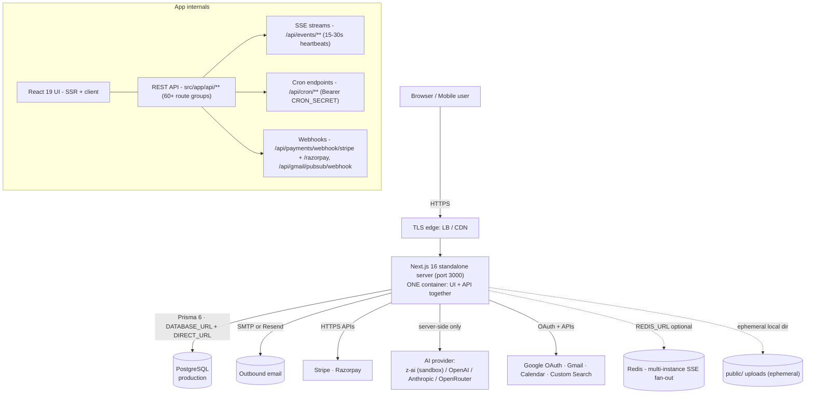

# AcquisitionOS Architecture (Verified) & the Four Deployment Approaches

Everything in section 1 was verified by reading this repository — the `package.json`, `next.config.ts`, `Dockerfile`, `prisma/schema*.prisma`, `src/lib/*` services, and the `src/app/api/*` route tree. If a future change to the code contradicts this document, **the code wins** — update this page as part of that change.

---

## 1. What AcquisitionOS actually is



### Verified stack

| Layer | Technology | Evidence in repo |
| --- | --- | --- |
| Framework | Next.js **16.1.1** (App Router), React 19, TypeScript 5 | `package.json` |
| Styling | Tailwind CSS 4, Radix UI primitives | `package.json`, `components.json` |
| Runtime | Node.js **20** (container: `node:20-alpine`) | `Dockerfile` |
| Server output | `output: 'standalone'` → `.next/standalone/server.js`, port **3000**, binds `0.0.0.0` | `next.config.ts`, `Dockerfile` CMD |
| Package manager (prod) | **npm** with `package-lock.json` (`npm ci`) | `Dockerfile`, `package-lock.json` |
| ORM / database | Prisma **6.x** — dev SQLite (`db/custom.db`), production **PostgreSQL** (`prisma/schema.production.prisma`) | `prisma/`, `src/lib/db.ts` |
| Auth | **Custom** JWT access+refresh cookies (`jose`, `jsonwebtoken`), `bcryptjs`, Google OAuth, email OTP + magic link | `src/lib/auth.ts`, `src/app/api/auth/**` |
| Email | Nodemailer SMTP **or** Resend | `src/lib/email.ts`, `src/lib/email-ethereal.ts` |
| Payments | **Stripe** and **Razorpay** (both integrated) | `src/lib/stripe-service.ts`, `src/lib/razorpay-service.ts` |
| AI | z-ai-web-dev-sdk primary + OpenAI/Anthropic/OpenRouter/local fallback chain (server-side only) | `src/lib/ai/ai-provider.ts` |
| Real-time | **SSE** via `/api/events/**`; optional Redis pub/sub for multi-instance | `src/lib/sse-manager.ts`, `src/lib/redis-pubsub-service.ts` |
| Observability | OpenTelemetry (OTLP), `/api/health`, `/api/health/detailed`, `/api/health/database`, `/api/metrics` | `src/instrumentation.ts`, `src/app/api/health/` |
| Tests | Vitest (`npm test`), ESLint (`npm run lint`) | `package.json` |

### Health endpoints (use these for load-balancer probes)

- `GET /api/health` — fast, **unauthenticated**; checks database connectivity (`db.user.count()`), heap memory, in-process error counts. **Use this one for LB health checks.**
- `GET /api/health/detailed` and `GET /api/health/database` — richer diagnostics; do **not** expose unauthenticated to the internet (protect at the LB or keep internal).

### Frontend/backend: one unit, two roles

AcquisitionOS has **no separate backend service**. The Next.js server renders the UI *and* handles `/api/**` requests in the same process. For deployment purposes:

- **"Frontend"** = the same container, serving pages and static assets (`frontend.md` in each cloud guide covers caching, build-time variables, CDN).
- **"Backend"** = the same container, serving `/api/**` (`backend.md` covers health checks, timeouts, SSE, webhooks).

You deploy **one service**. Splitting UI/API onto separate hosts is possible (an `api.` subdomain) but unnecessary and *not* the default this app is tuned for (see `06-dns-and-domains.md`).

---

## 2. Runtime behavior you must design for

### 2.1 Build-time vs runtime variables

- `NEXT_PUBLIC_*` variables are **inlined into client JavaScript at build time** — changing them later requires a rebuild.
- Everything else (`DATABASE_URL`, `JWT_SECRET`, `SMTP_*`, …) is read at **runtime** — change in the secret manager and restart the service.
- Full inventory: [`02-environment-variables-and-secrets.md`](./02-environment-variables-and-secrets.md).

### 2.2 Public URL resolution (`src/lib/app-url.ts`)

Magic links, OAuth redirects, and webhook-visible URLs are built in this priority order:

```text
1. x-forwarded-host + x-forwarded-proto headers (from your proxy/LB)
2. Origin header, 3. Referer header, 4. Host header   (browser-supplied)
5. APP_PUBLIC_URL env var
6. NEXT_PUBLIC_APP_URL env var
7. NEXTAUTH_URL env var
8. hardcoded constant https://acquisition.space-z.ai   (legacy fallback)
9. preview-domain fallback
```

**Deployment consequences (REQUIRED FOR CURRENT ACQUISITIONOS):**

- Your LB/proxy **must forward** `Host`, `X-Forwarded-Proto`, and ideally `X-Forwarded-Host`.
- Set `APP_PUBLIC_URL=https://app.yourdomain.com` (or `NEXT_PUBLIC_APP_URL`) so the app never falls back to the hardcoded legacy domain.
- Client-side code that needs the URL uses `NEXT_PUBLIC_APP_URL` at **build time** — rebuild images when it changes.

### 2.3 SSE (Server-Sent Events) — the real-time transport

- Endpoints: `/api/events/notifications`, `/api/events/payments`, `/api/events/analytics`, `/api/events/messages`, `/api/events/workflows`, `/api/events/ai`, plus a generic `/api/ws`.
- Heartbeats every **15–30 s**; clients reconnect automatically and replay missed events via `Last-Event-ID` (`/api/realtime/recover`).
- Events originate in-process; **`REDIS_URL` (`OPTIONAL`)** fans them out across multiple instances. Without Redis, events work only within one instance — fine for single-instance deployments.
- **Load balancer requirements:** idle/read timeout ≥ **120 s**; disable response buffering & gzip for `/api/events/*`; keep **min instances ≥ 1** on autoscaling platforms so a scaled-to-zero service doesn't break live streams.

### 2.4 Scheduled work — HTTP cron, no in-app scheduler

`REQUIRED FOR CURRENT ACQUISITIONOS`: an external scheduler must call these endpoints with header `Authorization: Bearer <CRON_SECRET>`:

```text
/api/cron/autonomous-outreach    /api/cron/credit-renewal        /api/cron/end-of-period
/api/cron/expire-api-keys        /api/cron/hot-lead-scan         /api/cron/meeting-reminders
/api/cron/payment-reconciliation /api/cron/process-gmail-replies /api/cron/process-sequences
/api/cron/renew-subscriptions    /api/cron/sdr-cycle             /api/cron/sequence-processing
/api/payments/process-billing    /api/feedback/retry-emails      /api/gmail/jobs/process (GMAIL_CRON_API_KEY)
```

Recommended starting schedule (tune to your usage):

| Endpoint | Suggested cadence |
| --- | --- |
| `/api/cron/expire-api-keys` | every 15–30 min |
| `/api/cron/hot-lead-scan` | every 15–60 min |
| `/api/cron/process-sequences`, `/api/cron/sequence-processing` | every 5–15 min |
| `/api/cron/meeting-reminders` | every 5–15 min |
| `/api/cron/autonomous-outreach`, `/api/cron/sdr-cycle` | every 15–60 min |
| `/api/cron/process-gmail-replies` | every 5–15 min (skip if Gmail Pub/Sub push is configured) |
| `/api/cron/credit-renewal`, `/api/cron/end-of-period`, `/api/cron/renew-subscriptions`, `/api/cron/payment-reconciliation` | daily (off-peak) |

> The GLM **sandbox** dev tooling in this workspace (mini-services, keep-alive scripts) is *not* production architecture — never deploy it. The tables above are the production approach.

### 2.5 Ephemeral filesystem

Uploads (e.g. `public/feedback-uploads/`) and generated invoices (`public/invoices/`) live on the container filesystem. Containers are replaceable → files vanish on redeploy or across instances. `OPTIONAL` mitigations per cloud: persistent volume (single-instance only) or object storage integration. Plan for this before you have users who care.

### 2.6 What AcquisitionOS does **not** use (do not provision it)

- ❌ No Kubernetes requirement (`deploy/k8s/*` contains **legacy** templates referencing Celery/Redis/Postgres stateful sets that do not match this Next.js app — treat as historical reference only).
- ❌ No message queue (SQS / Pub/Sub queues / Service Bus / Cloudflare Queues) — jobs run in-process and via HTTP cron.
- ❌ No in-app scheduler/worker processes — only the HTTP cron endpoints above.
- ❌ No NextAuth server despite `next-auth` appearing in `package.json` — it is **never imported** (vestigial). Auth is the custom JWT implementation.
- ❌ No WebSocket server inside the app — `socket.io-client` talks to an **optional external** WS service; production real-time is SSE.
- ⚠️ The `z-ai-web-dev-sdk` primary AI provider is wired to the GLM sandbox gateway and reads no API-key env vars. Outside that environment its availability is **NEEDS VERIFICATION** — always configure at least one fallback provider key (OpenAI / Anthropic / OpenRouter) in production.

---

## 3. Comparing the four deployment approaches

Factual trade-offs. **No platform is declared superior** — pick by your constraints.

| Dimension | GCP (Cloud Run) | AWS (ECS Fargate) | Azure (Container Apps) | Cloudflare (Workers + OpenNext) |
| --- | --- | --- | --- | --- |
| **Frontend architecture** | Container on Cloud Run; optional global LB + Cloud CDN; scale-to-zero | Container on Fargate behind ALB; static caching via CloudFront optional | Container App with ingress; Front Door for global edge caching | Next.js served from Workers via `@opennextjs/cloudflare`; static assets on Workers Assets/R2 |
| **Backend architecture** | Same Cloud Run service (`/api/**` in-process) | Same ECS service (`/api/**`) | Same Container App (`/api/**`) | Same Worker, subject to runtime limits (CPU-time per request, Node-API subset) |
| **Database** | Cloud SQL PostgreSQL (Auth Proxy / Private IP) | RDS PostgreSQL (+ RDS Proxy) | Azure Database for PostgreSQL Flexible Server | External PostgreSQL via **Hyperdrive** (keep Postgres; do not move to D1) |
| **Networking** | Serverless VPC connector / Direct VPC; LB with managed certs | VPC, subnets, security groups, ALB (raise idle timeout for SSE) | VNet integration; Front Door (disable buffering for SSE) | Cloudflare edge; no VPC; Workers connect out to Postgres/Redis |
| **Secrets** | Secret Manager → env vars at deploy | Secrets Manager / SSM → task definition | Key Vault + Managed Identity → Container App secrets | Wrangler secrets / Workers vars |
| **CI/CD** | Cloud Build or GitHub Actions → `gcloud run deploy` | GitHub Actions → ECR → ECS task def + deploy | GitHub Actions → ACR → Container App revision | GitHub Actions → `wrangler deploy` |
| **Observability** | Cloud Logging/Monitoring (+ OTLP support) | CloudWatch (+ OTLP) | Log Analytics / App Insights (OTLP endpoint supported) | Workers observability (`wrangler tail`, logs), external OTLP |
| **Scaling** | Instances autoscale 0→N; set min=1 for SSE | ECS service + target-tracking autoscaling | KEDA-based autoscaling; min replicas for SSE | Workers scale automatically (per-request model) |
| **SSE friendliness** | Good with min-instances=1 + CPU-always + ≥120 s timeout | Good with ALB idle timeout ≥120 s | Good with route buffering off + timeout tuning | Works (streaming supported) but subject to Workers CPU/duration limits per plan |
| **Operational complexity** | **Low** — fewest moving parts | **Medium-high** — VPC/ALB/task defs to configure | **Low-medium** | **Medium** — adapter layer + limits to understand |
| **Portability** | High (container + Postgres) | High (container + Postgres) | High (container + Postgres) | Medium (OpenNext adapter couples runtime to CF) |
| **Vendor lock-in risk** | Low-medium | Low-medium | Low-medium | **Higher** (Workers runtime + edge primitives) |
| **Gmail Pub/Sub fit** | Native (same ecosystem) | Needs a separate (free-tier) GCP project for Pub/Sub | Same as AWS | Same as AWS |
| **Approx. complexity for a beginner** | ★☆☆ | ★★★ | ★★☆ | ★★☆ |

**Reading the table:** if you want the fewest decisions, the GCP and Azure paths are the smallest managed surfaces. AWS offers the most control and matches the Terraform already in this repo. Cloudflare is the most cost-attractive at low traffic and the most constrained runtime — read `cloudflare/architecture.md` before committing.

---

## 4. Component-to-service map (quick reference)

| AcquisitionOS need | GCP | AWS | Azure | Cloudflare |
| --- | --- | --- | --- | --- |
| Container hosting | Cloud Run | ECS Fargate | Container Apps | Workers (OpenNext) |
| Registry | Artifact Registry | ECR | ACR | Workers build / CF registry |
| PostgreSQL | Cloud SQL | RDS | PostgreSQL Flexible Server | External (Hyperdrive) |
| Secrets | Secret Manager | Secrets Manager / SSM | Key Vault | Wrangler secrets |
| Scheduler | Cloud Scheduler | EventBridge Scheduler | Azure Functions timer / Container Apps Job | Cron Triggers |
| DNS | Cloud DNS | Route 53 | Azure DNS | Cloudflare DNS |
| TLS | Certificate Manager | ACM | Front Door managed cert | Universal SSL |
| Object storage (optional) | Cloud Storage | S3 | Blob Storage | R2 |
| Redis (optional) | Memorystore | ElastiCache | Azure Cache for Redis | Upstash for Redis (external) |
| Logs/metrics | Cloud Logging/Monitoring | CloudWatch | App Insights / Log Analytics | Workers observability |

---

## 5. Official documentation (architecture-level)

- Next.js deployment docs — https://nextjs.org/docs/app/getting-started/deploying
- Next.js standalone output — https://nextjs.org/docs/app/api-reference/config/next-config-js/output
- Prisma deployment guide — https://www.prisma.io/docs/orm/prisma-client/deployment
- Prisma PostgreSQL connection management — https://www.prisma.io/docs/orm/prisma-client/setup-and-configuration/databases-connections/postgresql
- MDN: Server-Sent Events — https://developer.mozilla.org/en-US/docs/Web/API/Server-sent_events
- Google Cloud docs — https://cloud.google.com/docs
- AWS docs — https://docs.aws.amazon.com/
- Microsoft Azure docs — https://learn.microsoft.com/azure/
- Cloudflare docs — https://developers.cloudflare.com/
- OpenNext (Next.js on non-Vercel runtimes) — https://opennext.js.org/
