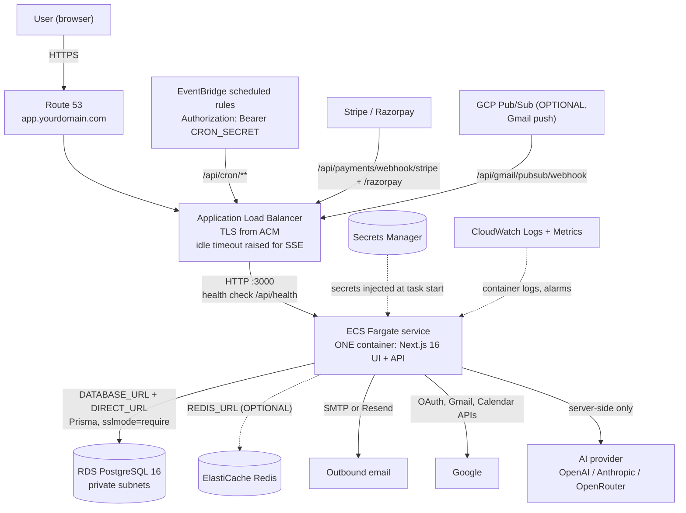

# AcquisitionOS on AWS — Deployment Guide (Entry Point)

This folder deploys AcquisitionOS — a **single Next.js 16 application** (UI + API in one container, port 3000) — to Amazon Web Services. It is written for readers with little or no AWS experience: every step explains *what → why → command → expected output → how to verify*.

Read the shared chapters first — they apply on every cloud and are referenced throughout:

- [`../00-prerequisites.md`](../00-prerequisites.md) — tools and concepts (Docker, Terraform, secrets, TLS)
- [`../01-architecture.md`](../01-architecture.md) — the verified AcquisitionOS architecture
- [`../02-environment-variables-and-secrets.md`](../02-environment-variables-and-secrets.md) — every env var the app reads
- [`../03-docker.md`](../03-docker.md) — how the container image is built (including two files you must create first)
- [`../04-database-production.md`](../04-database-production.md) — PostgreSQL + Prisma in production
- [`../05-cicd.md`](../05-cicd.md) — GitHub Actions patterns (used in [`terraform.md`](./terraform.md))
- [`../06-dns-and-domains.md`](../06-dns-and-domains.md) — domains, DNS records, the `app.` pattern

---

## 1. AWS component map

Every component below maps to a verified AcquisitionOS need (see [`architecture.md`](./architecture.md) for the full mapping).

| AWS service | Role in this deployment | Status |
| --- | --- | --- |
| **ECS Fargate** | Runs the one Next.js container (UI + API together) | REQUIRED FOR CURRENT ACQUISITIONOS |
| **Application Load Balancer (ALB)** | TLS-terminating edge; idle timeout raised for SSE; health check `/api/health` | REQUIRED FOR CURRENT ACQUISITIONOS |
| **ECR** | Stores the container image (`acquisitionos:<git-sha>`) | REQUIRED FOR CURRENT ACQUISITIONOS |
| **RDS PostgreSQL 16** | Production database (53+ Prisma models) | REQUIRED FOR CURRENT ACQUISITIONOS |
| **RDS Proxy** | Managed connection pooler in front of RDS | OPTIONAL (alternative: `connection_limit` in `DATABASE_URL`) |
| **Secrets Manager** / **SSM Parameter Store** | Stores `DATABASE_URL`, `JWT_SECRET`, payment/AI keys; injected into the ECS task | REQUIRED FOR CURRENT ACQUISITIONOS |
| **EventBridge (scheduled rules + API destinations)** | Calls the 15 Bearer-protected `/api/cron/*` style endpoints on a schedule | REQUIRED FOR CURRENT ACQUISITIONOS |
| **Route 53** | DNS for `app.yourdomain.com` (A/AAAA ALIAS to the ALB) | REQUIRED FOR CURRENT ACQUISITIONOS (or any external DNS) |
| **ACM** | Free managed TLS certificate on the ALB | REQUIRED FOR CURRENT ACQUISITIONOS |
| **VPC, subnets, security groups, NAT/IGW** | Network isolation: ALB public, app + database private | REQUIRED FOR CURRENT ACQUISITIONOS |
| **CloudWatch Logs + Alarms** | Container logs, CPU/memory metrics, basic alerting | REQUIRED FOR CURRENT ACQUISITIONOS (logging is on by default; alarms recommended) |
| **ElastiCache Redis** | Cross-instance SSE fan-out via `REDIS_URL` | OPTIONAL (single instance works without it) |
| **S3** | Durable storage for uploads/invoices (container filesystem is ephemeral) + DB dumps | OPTIONAL |
| **CloudFront** | Global edge caching of static assets in front of the ALB | OPTIONAL |
| **EKS, Lambda, SQS, API Gateway** | Not used by the current app | FUTURE/ALTERNATIVE — do not provision |

> Repository caution: `deploy/k8s/*` contains **legacy** Kubernetes templates (Celery worker/beat, Redis, Postgres stateful sets) that do **not** match the current Next.js app. Do not use them as a blueprint for this AWS deployment. The AWS Terraform at `deploy/terraform/main.tf`, on the other hand, covers the right service set — see [`terraform.md`](./terraform.md).

---

## 2. High-level architecture



Key points (all verified in [`../01-architecture.md`](../01-architecture.md)):

- **One container.** The ECS service runs a single Next.js standalone server that serves pages, `/api/**`, SSE streams, and webhook receivers. There is no separate backend service to deploy.
- **Public URL headers matter.** The app derives URLs from `Host` + `X-Forwarded-Proto` (ALB sends both by default) and falls back to `APP_PUBLIC_URL`. Set that env var to `https://app.yourdomain.com`.
- **SSE needs a patient load balancer.** ALB idle timeout: default 60 s is too low; raise to **3600 s** (recommended) or at minimum **120 s**. Keep `desired count >= 1` always.
- **Cron is HTTP.** EventBridge scheduled rules call `https://app.yourdomain.com/api/cron/**` with `Authorization: Bearer <CRON_SECRET>`. There is no in-app scheduler.
- **Secrets never enter the image.** They live in Secrets Manager and are injected into the task definition at launch.

---

## 3. Deployment order

Follow this sequence. Each number links to the file that covers it.

```text
 1. AWS account, billing guardrails, CLI            → prerequisites.md
 2. Build + push the container image to ECR         → manual-deployment.md §2 (with ../03-docker.md)
 3. VPC, subnets, security groups                   → manual-deployment.md §3-4, networking.md
 4. RDS PostgreSQL + database + app_user            → manual-deployment.md §5, database.md
 5. Secrets in Secrets Manager                      → manual-deployment.md §6, secrets.md
 6. Task definition + ALB + target group            → manual-deployment.md §7-8
 7. ECS cluster + service (first deploy)            → manual-deployment.md §9
 8. Run prisma db push (one-off, DIRECT_URL)        → manual-deployment.md §10, ../04-database-production.md
 9. ACM certificate + Route 53 records              → manual-deployment.md §11, ../06-dns-and-domains.md
10. EventBridge scheduled rules (15 cron endpoints) → manual-deployment.md §12
11. CloudWatch log group + basic alarms             → manual-deployment.md §13
12. Verify end to end                               → checklist in §5 below
13. Optional hardening: RDS Proxy, ElastiCache, S3, CloudFront, CI/CD via Terraform → database.md, networking.md, terraform.md
```

Steps 1–12 produce a working production deployment without any automation. `terraform.md` then codifies everything so it can be reproduced and reviewed.

---

## 4. Files in this folder

| File | Contents |
| --- | --- |
| `README.md` | You are here — component map, architecture, deployment order, end-to-end checklist |
| `architecture.md` | How AcquisitionOS maps onto AWS services; SSE requirements; what you do NOT need |
| `prerequisites.md` | AWS account, root MFA + IAM admin user, budgets, region, CLI, quotas |
| `manual-deployment.md` | The complete click-by-click production deployment (start here after prerequisites) |
| `terraform.md` | Infrastructure as Code — aligned with `deploy/terraform/main.tf` in this repo |
| `networking.md` | VPC design, security group layering, ALB tuning for SSE, optional CloudFront |
| `database.md` | RDS PostgreSQL: sizing, SSL, backups, RDS Proxy, connection budget |
| `secrets.md` | Secrets Manager for the full env var inventory + IAM least privilege |
| `frontend.md` | The Next.js UI: build-time vs runtime variables, caching, staging, rollback pointers |

Later parts of the AWS guide (backend, dns-ssl, cicd, monitoring, backups, security, scaling, rollback, troubleshooting) extend this folder.

---

## 5. End-to-end checklist

Work top to bottom. Items marked (R) are REQUIRED FOR CURRENT ACQUISITIONOS; (O) OPTIONAL.

### Before deployment

- [ ] (R) AWS account with MFA on root; daily work done by an IAM admin user or Identity Center user — [`prerequisites.md`](./prerequisites.md)
- [ ] (R) Monthly budget alarm + Cost Anomaly Detection enabled — [`prerequisites.md`](./prerequisites.md)
- [ ] (R) One region chosen (example `us-east-1`) and used consistently — [`prerequisites.md`](./prerequisites.md)
- [ ] (R) AWS CLI v2 installed and `aws configure` verified with `aws sts get-caller-identity` — [`prerequisites.md`](./prerequisites.md)
- [ ] (R) `.npmrc` (with `legacy-peer-deps=true`) and `.dockerignore` created at the repo root — [`../03-docker.md`](../03-docker.md) §3
- [ ] (R) Local `docker build` succeeds and `/api/health` responds in a local run — [`../03-docker.md`](../03-docker.md) §4-5
- [ ] (R) Domain `app.yourdomain.com` purchased/delegated and usable — [`../06-dns-and-domains.md`](../06-dns-and-domains.md)

### Infrastructure

- [ ] (R) ECR repository `acquisitionos` created; image pushed with the git SHA tag — [`manual-deployment.md`](./manual-deployment.md) §2
- [ ] (R) VPC with 2 public + 2 private subnets across 2 AZs; IGW; NAT (or public-IP tasks) — [`manual-deployment.md`](./manual-deployment.md) §3, [`networking.md`](./networking.md)
- [ ] (R) Security groups layered: world → ALB (80/443); ALB → app (3000); app → RDS (5432) — [`manual-deployment.md`](./manual-deployment.md) §4
- [ ] (R) RDS PostgreSQL 16 in private subnets: `sslmode=require`, backup retention >= 7 days, PITR on — [`manual-deployment.md`](./manual-deployment.md) §5, [`database.md`](./database.md)
- [ ] (O) RDS Proxy created if you rely on many concurrent connections — [`database.md`](./database.md)
- [ ] (O) ElastiCache Redis cluster if you plan > 1 task instance — [`networking.md`](./networking.md), [`database.md`](./database.md)

### Application

- [ ] (R) All secrets in Secrets Manager (see per-variable table) — [`secrets.md`](./secrets.md)
- [ ] (R) Task definition: 1–2 vCPU / 2–4 GB, port 3000, `healthCheck` on `/api/health`, secrets via ARNs — [`manual-deployment.md`](./manual-deployment.md) §7
- [ ] (R) Execution role can read your secret ARNs; task role minimal — [`secrets.md`](./secrets.md)
- [ ] (R) ALB: 443 listener with ACM cert, 80 → 443 redirect, target group `HTTP:3000`, health check `/api/health` matcher 200, idle timeout >= 120 s (3600 s recommended), deregistration delay 30 s — [`manual-deployment.md`](./manual-deployment.md) §8, [`networking.md`](./networking.md)
- [ ] (R) ECS service running with desired count >= 1 (2 for HA); rolling deploys — [`manual-deployment.md`](./manual-deployment.md) §9
- [ ] (R) Schema applied once with `npx prisma db push --schema=prisma/schema.production.prisma` using `DIRECT_URL` — [`manual-deployment.md`](./manual-deployment.md) §10
- [ ] (R) `APP_PUBLIC_URL=https://app.yourdomain.com` (runtime) and `NEXT_PUBLIC_APP_URL` (build-time) set to the same value — [`frontend.md`](./frontend.md)
- [ ] (R) Webhook URLs `https://app.yourdomain.com/api/payments/webhook/stripe` (Stripe) and `https://app.yourdomain.com/api/payments/webhook/razorpay` (Razorpay) registered — [`../02-environment-variables-and-secrets.md`](../02-environment-variables-and-secrets.md) §4
- [ ] (R) EventBridge scheduled rules created for all 15 cron endpoints with `Authorization: Bearer <CRON_SECRET>` — [`manual-deployment.md`](./manual-deployment.md) §12
- [ ] (R) CloudWatch log group `/acquisitionos/production` receiving logs; retention set (e.g. 30 days) — [`manual-deployment.md`](./manual-deployment.md) §13

### Production hardening (before or right after go-live)

- [ ] (R) `AUTH_DEV_MODE` unset/false; no `localhost` URLs anywhere in config — [`../02-environment-variables-and-secrets.md`](../02-environment-variables-and-secrets.md) §1
- [ ] (R) At least one AI fallback provider key set (`OPENAI_API_KEY` / `ANTHROPIC_API_KEY` / `OPENROUTER_API_KEY`) — [`../02-environment-variables-and-secrets.md`](../02-environment-variables-and-secrets.md) §6
- [ ] (R) RDS deletion protection + a manual snapshot taken before any schema change — [`database.md`](./database.md)
- [ ] (R) Secrets never committed; `.gitignore` still excludes `.env*` — [`secrets.md`](./secrets.md)
- [ ] (O) S3 bucket for durable uploads/invoices (container disk is ephemeral) — [`architecture.md`](./architecture.md)
- [ ] (O) CloudFront in front of the ALB caching static assets only — [`networking.md`](./networking.md)
- [ ] (O) Terraform-managed infrastructure + OIDC-based CI/CD on `main` — [`terraform.md`](./terraform.md), [`../05-cicd.md`](../05-cicd.md)

### Verification (run against `https://app.yourdomain.com`)

- [ ] (R) `curl -i https://app.yourdomain.com/api/health` → HTTP 200, database healthy
- [ ] (R) Login works: password sign-in, **email OTP**, and **magic link** all deliver and authenticate
- [ ] (R) SSE notifications bell updates live while the app is open (keep the tab open 10+ minutes; no disconnects)
- [ ] (R) One real workflow run completes end to end (create → execute → view results)
- [ ] (R) Lead discovery works (Google Custom Search or SerpAPI key configured)
- [ ] (R) One AI feature works (chat, analysis, or outreach generation)
- [ ] (R) Billing webhook test: trigger a Stripe/Razorpay test event and see it land in `/api/payments/webhook/stripe` (or `/api/payments/webhook/razorpay`; check ALB access logs / app logs for a 200)
- [ ] (O) Gmail connect works if you use Gmail features (OAuth connect + reply ingestion)
- [ ] (R) CloudWatch shows no repeated `unhealthy host` or 5xx spikes over 30 minutes

---

## 6. Cost considerations

This handbook deliberately does not quote prices (they change). Use AWS Pricing Calculator for your region. Rough shape for a minimal single-region deployment: one Fargate task (1 vCPU/2 GB), one RDS `db.t4g.medium`, ALB, NAT gateway (if used), data transfer. Budget alarms from [`prerequisites.md`](./prerequisites.md) catch surprises; the biggest avoidable costs are a forgotten NAT gateway + large Multi-AZ instances on a staging environment.

---

## 7. Official Documentation

- Amazon ECS (Fargate) — https://docs.aws.amazon.com/ecs/
- Amazon RDS for PostgreSQL — https://docs.aws.amazon.com/rds/
- Amazon ECR — https://docs.aws.amazon.com/ecr/
- AWS Secrets Manager — https://docs.aws.amazon.com/secrets-manager/
- Amazon EventBridge — https://docs.aws.amazon.com/eventbridge/
- Amazon Route 53 — https://docs.aws.amazon.com/route53/
- AWS Certificate Manager (ACM) — https://docs.aws.amazon.com/acm/
- Elastic Load Balancing (ALB) — https://docs.aws.amazon.com/elasticloadbalancing/
- Amazon CloudWatch — https://docs.aws.amazon.com/amazon-cloudwatch/
- Terraform AWS provider — https://developer.hashicorp.com/terraform/language/providers/aws
