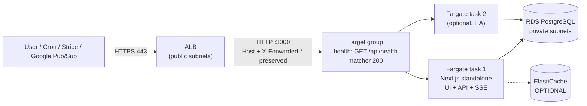

# AcquisitionOS → AWS Service Mapping

This page answers two questions before you touch the console: *which AWS services does AcquisitionOS actually need*, and *which AWS behaviors must be configured specifically because of how this app works* (SSE, headers, HTTP cron). Facts about the app come from [`../01-architecture.md`](../01-architecture.md) and were verified in the repository.

---

## 1. Request flow on AWS

One ECS service, one container image, one port (3000). The ALB is the only public entry point; everything behind it is private.

---

## 2. AcquisitionOS need → AWS service

| AcquisitionOS need (verified) | AWS service used | Label |
| --- | --- | --- |
| Run one Node 20 container, always-on, port 3000 | ECS Fargate service (launch type Fargate, `awsvpc` networking) | REQUIRED FOR CURRENT ACQUISITIONOS |
| Public HTTPS entry with TLS + header forwarding | Application Load Balancer + ACM certificate | REQUIRED FOR CURRENT ACQUISITIONOS |
| DNS for `app.yourdomain.com` | Route 53 (A/AAAA ALIAS to ALB) | REQUIRED (or any external DNS provider) |
| Container registry | Amazon ECR (`acquisitionos:<git-sha>` + `latest`) | REQUIRED FOR CURRENT ACQUISITIONOS |
| PostgreSQL 14+ (Prisma 6, 53+ models) | RDS for PostgreSQL 16, private subnets, `sslmode=require` | REQUIRED FOR CURRENT ACQUISITIONOS |
| Connection pooling for Prisma | RDS Proxy **or** `connection_limit=10` in `DATABASE_URL` | OPTIONAL (start with `connection_limit`) |
| Secret storage (`JWT_SECRET`, DB password, provider keys) | Secrets Manager (SSM Parameter Store is the cheaper alternative) | REQUIRED FOR CURRENT ACQUISITIONOS |
| Scheduler for 15 HTTP cron endpoints | EventBridge: scheduled rules → API destinations (Bearer `CRON_SECRET` header) | REQUIRED FOR CURRENT ACQUISITIONOS |
| Inbound webhooks (Stripe, Razorpay, optional Gmail Pub/Sub) | Public ALB paths: `/api/payments/webhook/stripe` + `/api/payments/webhook/razorpay`, `/api/gmail/pubsub/webhook` | REQUIRED FOR CURRENT ACQUISITIONOS |
| Logs + metrics | CloudWatch Logs (awslogs driver) + CloudWatch metrics/alarms | REQUIRED (logging); alarms recommended |
| Outbound HTTPS from the container (SMTP, Stripe, Google, AI APIs) | NAT gateway (private subnets) or public IP on Fargate tasks | REQUIRED FOR CURRENT ACQUISITIONOS (one of the two) |
| Cross-instance SSE fan-out (`REDIS_URL`) | ElastiCache for Redis (server-side bus) | OPTIONAL |
| Durable uploads (`public/` is ephemeral per container) | S3 bucket (app-level integration; also used for DB dumps) | OPTIONAL |
| Static asset edge cache | CloudFront in front of the ALB (static only; do not cache `/api`) | OPTIONAL |
| Gmail push notifications | Google Cloud Pub/Sub (a separate, free GCP project) → `/api/gmail/pubsub/webhook` | OPTIONAL (feature-level; fallback is the cron endpoint) |

## 3. SSE (Server-Sent Events) on an ALB — the AWS-specific tuning

The app streams real-time updates over long-lived HTTP (`/api/events/notifications`, `/api/events/payments`, `/api/events/analytics`, `/api/events/messages`, `/api/events/workflows`, `/api/events/ai`) with heartbeats every 15–30 s. Three ALB settings matter:

1. **Idle timeout.** The ALB closes a connection after `idle_timeout` seconds of no traffic. Default is **60 s** — too close to the heartbeat cadence and prone to disconnecting slow streams. Set **3600 s (recommended)**, minimum **120 s**. Covered with exact commands in [`manual-deployment.md`](./manual-deployment.md) §8 and [`networking.md`](./networking.md) §4.
2. **Target group health check.** Use `GET /api/health` (unauthenticated, checks DB + memory) with matcher `200`. The richer `/api/health/detailed` and `/api/health/database` endpoints exist but should not be exposed to the internet — the ALB health check goes over the internal target path, so `/api/health` is the right probe.
3. **Deregistration delay.** Set **30 s** so in-flight SSE streams get a grace period when a task is drained during deploys, without delaying rollouts. The app's SSE clients reconnect automatically (15–30 s heartbeats + `Last-Event-ID` replay via `/api/realtime/recover`).

Also: keep the ECS service **desired count >= 1 at all times** (never scale to zero) and do not enable aggressive ALB response buffering/compression for `/api/events/*` (the ALB does not buffer responses by default; if you add CloudFront, configure it per [`networking.md`](./networking.md) §6).

## 4. Header forwarding (public URL resolution)

`src/lib/app-url.ts` builds magic links, OAuth redirects, and webhook URLs from `x-forwarded-host` + `x-forwarded-proto` first, then `APP_PUBLIC_URL` / `NEXT_PUBLIC_APP_URL`. On AWS this means:

- ALB listeners preserve `Host` and add `X-Forwarded-Proto: https` / `X-Forwarded-For` by default — no extra configuration, but **do not put a proxy in front that strips them** (and if you add CloudFront, forward the `Host` header for dynamic routes).
- Set `APP_PUBLIC_URL=https://app.yourdomain.com` in the task definition so the app never falls back to the hardcoded legacy domain (`https://acquisition.space-z.ai`).

## 5. What AcquisitionOS does NOT need on AWS

Do not provision any of this for the current app. Listed so nobody adds cost and complexity by accident.

| AWS service | Why not | Label |
| --- | --- | --- |
| EKS / Kubernetes (EKS Anywhere, Fargate profiles for EKS) | One container; ECS Fargate is simpler. Also: `deploy/k8s/*` in this repo is a **legacy** set of Celery/Redis/Postgres stateful templates that does **not** match the Next.js app — historical reference only | FUTURE/ALTERNATIVE |
| Lambda (functions for API or cron) | The API is the Next.js server itself; cron is HTTP-callback based. A small Lambda "cron → HTTPS forwarder" is possible but unnecessary given EventBridge API destinations | FUTURE/ALTERNATIVE |
| SQS / SNS message queues | Jobs run in-process and via HTTP cron. No queue consumers exist in the code | FUTURE/ALTERNATIVE |
| API Gateway | Only needed if you prefer EventBridge Scheduler's templated targets over scheduled rules with API destinations (see [`manual-deployment.md`](./manual-deployment.md) §12) | FUTURE/ALTERNATIVE |
| SES (email sending) | The app sends mail through its own SMTP/Resend integration. You may point the existing `SMTP_*` settings at SES's SMTP interface if you want an AWS inbox for mail — that is a provider swap, not an integration | OPTIONAL (SMTP provider for the app's existing SMTP settings) |
| ECS on EC2 (self-managed instances) | Fargate removes server management; EC2 launch type adds patching work | FUTURE/ALTERNATIVE |
| Elastic Beanstalk / App Runner | Alternative container hosts, not needed alongside ECS; the repo's Terraform targets ECS | FUTURE/ALTERNATIVE |

## 6. Label summary

Applying the handbook convention (see the root [`README.md`](../README.md) §7):

- **REQUIRED FOR CURRENT ACQUISITIONOS** — ECS Fargate, ALB, ECR, RDS PostgreSQL, Secrets Manager (or SSM), EventBridge scheduled rules, VPC/subnets/security groups, outbound internet path (NAT or public IPs), ACM certificate, CloudWatch logging, DNS record for the app host.
- **OPTIONAL** — RDS Proxy, ElastiCache Redis, S3 (uploads/backups), CloudFront, CloudWatch alarms, SES as SMTP provider, GCP Pub/Sub project for Gmail push, VAPID/Telegram channels.
- **FUTURE/ALTERNATIVE** — EKS, Lambda, SQS/SNS, API Gateway, ECS on EC2, App Runner/Beanstalk, any message-queue-based job architecture.

## 7. Official Documentation

- Amazon ECS best practices — https://docs.aws.amazon.com/ecs/latest/bestpracticesguide/
- ALB listeners / idle timeout — https://docs.aws.amazon.com/elasticloadbalancing/latest/application/load-balancer-update-idle-timeout.html
- ALB target group health checks — https://docs.aws.amazon.com/elasticloadbalancing/latest/application/target-group-health-checks.html
- Amazon EventBridge API destinations — https://docs.aws.amazon.com/eventbridge/latest/userguide/eb-api-destinations.html
- AWS architecture center (general reference) — https://aws.amazon.com/architecture/
