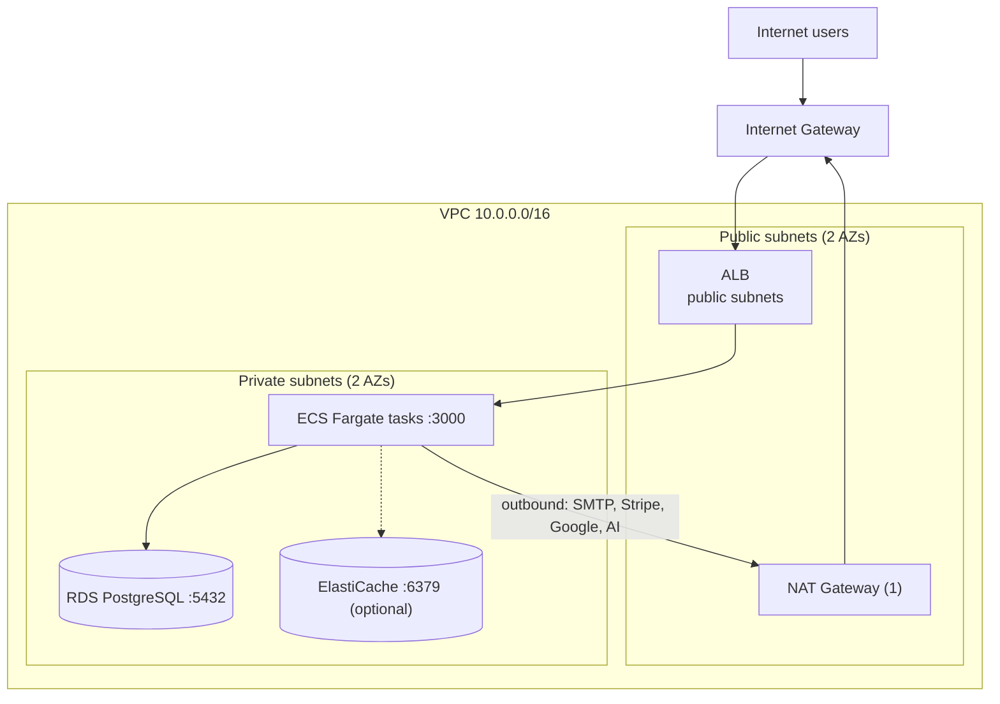
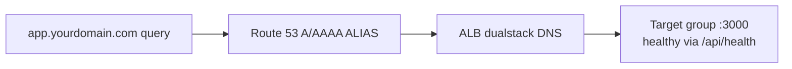

# Networking — VPC, Security Groups, ALB, DNS on AWS

This page explains the *why* behind every network choice in [`manual-deployment.md`](./manual-deployment.md) §3-4 and §8, and the settings that exist specifically because of how AcquisitionOS works: long-lived SSE streams, proxy-derived public URLs, and inbound webhooks.

---

## 1. VPC design



Layout (mirrors `deploy/terraform/main.tf`):

| Subnet | Contents | Route | Why |
| --- | --- | --- | --- |
| Public ×2 (2 AZs) | ALB nodes (+ NAT gateway) | `0.0.0.0/0` → IGW | ALB must accept internet traffic; two AZs so a zone failure does not take the site down |
| Private ×2 (2 AZs) | ECS tasks, (ElastiCache) | `0.0.0.0/0` → NAT | App servers have no public inbound path; they still need outbound HTTPS |
| Database subnets ×2 | RDS | no internet route | Deepest layer; only the app SG can reach port 5432 |

Practical notes:
- One NAT gateway is enough to start (it sits in one AZ; if that AZ fails, tasks there cannot reach the internet until it is recreated — two NAT gateways is the HA upgrade, roughly double the cost).
- Fargate tasks run with **one ENI each** in the private subnets (`awsvpc` mode); every task gets a private IP, which is what the ALB target group registers (`target_type = "ip"`).

## 2. The NAT-vs-public-IP decision (image pulls and outbound calls)

**The problem:** a Fargate task in a *private* subnet with no outbound route cannot pull its ECR image, cannot read Secrets Manager, and cannot call SMTP/Stripe/Google/AI APIs. AcquisitionOS does all four.

Two valid fixes:

| Option | How | Pros | Cons |
| --- | --- | --- | --- |
| **NAT gateway** (used in `deploy/terraform/main.tf`, default in this handbook) | Private subnets route through a NAT gateway; `assignPublicIp = DISABLED` | No task has any public IP; stable egress IP (NAT's EIP) that providers can allowlist | ~fixed monthly cost per gateway + data processing |
| **Public IPs on tasks** | Place tasks in the **public** subnets, `assignPublicIp = ENABLED` | Zero extra cost; ECR/Secrets pulls work directly — no NAT needed for image pulls | Each task has a public IP (inbound is still blocked by SG rules); egress IP changes per task; consider interface/endpoints later to re-privatize |

Beginner-safe recommendation: start with the public-IP option **only** if NAT cost matters and you understand the SG rules; otherwise NAT gateway. Either way, the ALB → task path is identical. A third, more advanced path — VPC interface endpoints for ECR, Secrets Manager, Logs, S3 — removes the internet path entirely but adds several endpoints (cost + complexity); label it an OPTIONAL hardening step once traffic and compliance demand it.

## 3. Security group layering

Each layer accepts traffic only from the previous layer — never from `0.0.0.0/0` except the ALB's edge:

```text
Internet ──80/443──▶ [ALB SG] ──3000──▶ [App SG] ──5432──▶ [RDS SG]
                                           └────6379────▶ [Redis SG] (optional)
```

- **ALB SG:** inbound 80 + 443 from `0.0.0.0/0`; egress to anywhere.
- **App SG (tasks):** inbound **3000/tcp** with source = ALB SG. Nothing else — no SSH (Fargate has none anyway), no port 8000 (a leftover in the legacy parts of `deploy/terraform/main.tf`; the single-container app does not use it).
- **RDS SG:** inbound 5432 with source = App SG.
- **Redis SG (optional):** inbound 6379 with source = App SG.

Security groups are stateful: replies flow automatically, so no extra egress rules are needed for the app → database direction. Verify a layer is correct with `aws ec2 describe-security-groups --group-ids <ID>` and read the ingress list.

## 4. ALB configuration (the SSE-critical part)

Four settings, in priority order:

1. **Idle timeout — raise it for SSE.** The ALB closes idle connections after `idle_timeout` seconds (default **60 s**). AcquisitionOS streams SSE with 15–30 s heartbeats on `/api/events/*`; a 60 s timeout is a race you will lose and users will see dead notification bells. Set **3600 s (recommended)** — minimum **120 s**:

   ```bash
   aws elbv2 modify-load-balancer-attributes \
     --load-balancer-arn ${ALB_ARN} \
     --attributes Key=idle_timeout.timeout_seconds,Value=3600
   # Terraform: aws_lb { idle_timeout = 3600 }
   ```

2. **Listeners.** Port **443 HTTPS** with the ACM certificate (`ELBSecurityPolicy-TLS13-1-2-2021-06`) forwarding to the target group; port **80 HTTP** exists only to **redirect to HTTPS** (`HTTP_301`). If CloudFront is added later (§6), keep both listeners — CloudFront may connect over HTTP.

3. **Target group.** `protocol = HTTP`, `port = 3000`, `target_type = ip` (Fargate tasks register by IP). Health check: `HTTP`, path **`/api/health`**, matcher **200**, interval 30 s, timeout 10 s, healthy 2 / unhealthy 3. `GET /api/health` is unauthenticated and checks DB + heap + error counts — exactly what a load balancer should probe. Do **not** point the health check at `/api/health/detailed` or `/api/health/database` (richer diagnostics; keep them out of public reach).

4. **Deregistration delay = 30 s.** When a task is drained (deploy, scale-in), the ALB stops sending new requests and gives existing ones — including live SSE streams — 30 s to finish. Shorter cuts streams abruptly mid-deploy; longer slows rollouts. The app's SSE clients auto-reconnect and replay missed events (`Last-Event-ID` → `/api/realtime/recover`), so 30 s is a good balance.

Command + Terraform forms for all of these are in [`manual-deployment.md`](./manual-deployment.md) §8 and [`terraform.md`](./terraform.md) §4.8.

## 5. Header forwarding (critical for `src/lib/app-url.ts`)

The app resolves its own public URL in priority order: `x-forwarded-host` + `x-forwarded-proto` → Origin → Referer → Host → `APP_PUBLIC_URL` → `NEXT_PUBLIC_APP_URL` → legacy fallback. Consequences on AWS:

- The **ALB forwards `Host` unchanged and adds `X-Forwarded-Proto: https`** (plus `X-Forwarded-For`, `X-Forwarded-Port`) by default. No configuration needed — but nothing downstream may strip them. Common accidents: putting another proxy in front with header rewriting, or a CloudFront origin policy that does not forward `Host` (§6).
- Set **`APP_PUBLIC_URL=https://app.yourdomain.com`** in the task definition. It is the deterministic override, so magic links and OAuth redirects never depend on which proxy header survived the hop (see [`../01-architecture.md`](../01-architecture.md) §2.2).
- Never let `Host` reach the app as the ALB's internal name (`xxx.us-east-1.elb.amazonaws.com`) in generated URLs — `APP_PUBLIC_URL` solves that too.

## 6. OPTIONAL: CloudFront in front of the ALB

What it is for here: **static asset caching only**. Next.js fingerprints everything under `/_next/static/*` with immutable `Cache-Control` headers, so edge caching is safe and effective for them.

Rules of engagement (get any of these wrong and you break the app):

- **`/api/*` must not be cached.** Create a cache behavior for `/api/*` (and `/api/events/*` explicitly) that **forwards all headers** and uses `CachingDisabled` policy. Webhooks, SSE, and auth endpoints are dynamic; caching them breaks billing callbacks, login, and real-time updates.
- **SSE through CloudFront:** CloudFront supports streaming responses, but verify end-to-end after setup (open the notifications bell through the distribution and keep it open 10+ minutes). If you see buffering/delays, exempt `/api/events/*` from CloudFront entirely (Route 53 → ALB for those paths is not possible per-path; instead keep CloudFront optional and bypassable). Note: the ALB does **not** buffer responses, so CloudFront is the only proxy here that could introduce buffering — treat it as the suspect if SSE misbehaves.
- **Forward `Host`/custom headers** for dynamic behaviors so `app-url.ts` header resolution still works.
- Keep the ALB reachable directly too (CloudFront origin), so removing CloudFront later is a DNS flip.

Given AcquisitionOS already compresses and fingerprints its static assets, CloudFront is an optimization, not a requirement. Label: **OPTIONAL**.

## 7. Route 53 records

- If the domain is managed in Route 53: create **A and AAAA records** (ALIAS) for `app.yourdomain.com` → the ALB (`dualstack.<alb-dns-name>`, hosted zone of the ALB, `evaluate_target_health = true`). ALIAS records resolve at the Route 53 edge — no TTL juggling when the ALB's IPs change.
- If DNS lives elsewhere: a `CNAME` (or provider ALIAS/ANAME) `app` → the ALB DNS name works (see [`../06-dns-and-domains.md`](../06-dns-and-domains.md) §5).
- ACM validation happens **once** via the CNAME the certificate request gives you ([`manual-deployment.md`](./manual-deployment.md) §11); renewal is automatic afterwards as long as the record stays.



## 8. Verification checklist

- [ ] ALB idle timeout reads 3600 (`aws elbv2 describe-load-balancer-attributes --load-balancer-arn ... --query "Attributes[?Key=='idle_timeout.timeout_seconds']"`)
- [ ] HTTPS listener serves the ACM cert; HTTP answers 301 to HTTPS
- [ ] Target health is `healthy` for every task; `curl -i https://app.yourdomain.com/api/health` → 200
- [ ] SSE survives: notifications bell live for 10+ minutes (idle timeout proof)
- [ ] Magic-link / OAuth emails contain `https://app.yourdomain.com/...` (header + `APP_PUBLIC_URL` proof)
- [ ] RDS unreachable from the internet (`psql` from your laptop to the DB host times out — expected)

## 9. Official Documentation

- VPC + subnets — https://docs.aws.amazon.com/vpc/latest/userguide/working-with-vpcs.html
- NAT gateways — https://docs.aws.amazon.com/vpc/latest/userguide/vpc-nat-gateway.html
- Security groups — https://docs.aws.amazon.com/vpc/latest/userguide/vpc-security-groups.html
- ALB listeners — https://docs.aws.amazon.com/elasticloadbalancing/latest/application/load-balancer-listeners.html
- ALB idle timeout — https://docs.aws.amazon.com/elasticloadbalancing/latest/application/load-balancer-update-idle-timeout.html
- Target group health checks — https://docs.aws.amazon.com/elasticloadbalancing/latest/application/target-group-health-checks.html
- ALB request tracing / headers — https://docs.aws.amazon.com/elasticloadbalancing/latest/application/x-forwarded-headers.html
- Route 53 alias records — https://docs.aws.amazon.com/Route53/latest/DeveloperGuide/resource-record-sets-choosing-alias-non-alias.html
