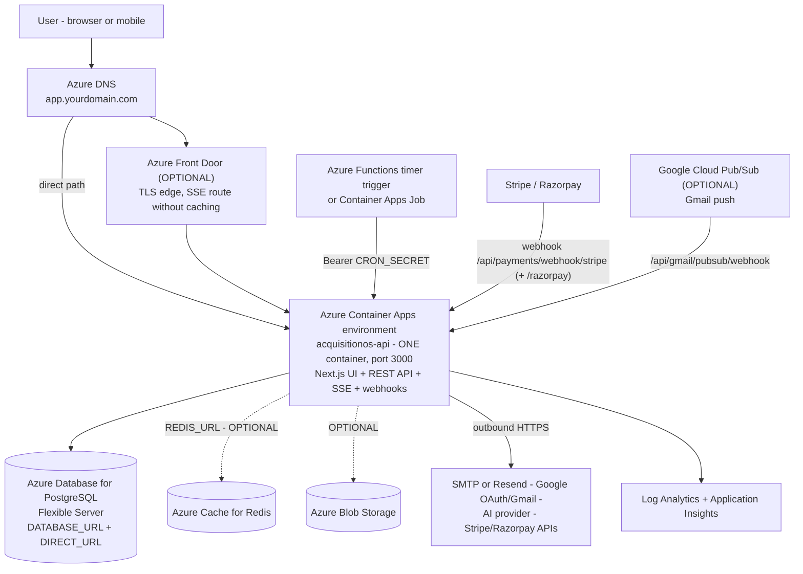

# Azure Deployment Guide — AcquisitionOS

**Audience:** engineers deploying AcquisitionOS to Microsoft Azure, including readers with no prior Azure experience.

**Scope of this folder:** Azure Container Apps (hosting), Azure Container Registry (images), Azure Database for PostgreSQL Flexible Server (database), Key Vault + Managed Identity (secrets), Azure Functions timer trigger or Container Apps Job (scheduler), Azure DNS, optional Azure Front Door, Log Analytics + Application Insights (observability), optional Blob Storage and Azure Cache for Redis.

> Labels used below: **REQUIRED FOR CURRENT ACQUISITIONOS**, **OPTIONAL**, **FUTURE/ALTERNATIVE**. Anything unverifiable is marked **NEEDS VERIFICATION**. AcquisitionOS facts in this folder come from the shared architecture brief in [`01-architecture.md`](../01-architecture.md) — do not provision services that are not listed here.

---

## 1. The 60-second version

AcquisitionOS is a **single Next.js 16 application** — UI and API in one container listening on port 3000. On Azure it runs in **Azure Container Apps**, backed by **Azure Database for PostgreSQL Flexible Server**, with secrets in **Key Vault** injected through a **Managed Identity** (no long-lived credentials in the app or in CI).

```text
Browser / Mobile
      |  HTTPS
      v
Azure DNS (app.yourdomain.com)  [+ Azure Front Door, OPTIONAL]
      |
      v
Azure Container Apps environment  <- ONE service, port 3000
  +-- Next.js UI (server-rendered + client)
  +-- REST API (/api/**)
  +-- SSE streams (/api/events/**)   -- min 1 replica, buffering/compression off
  +-- cron endpoints (/api/cron/**)  -- called by Azure Functions timer / CA Job
      |
      +--> Azure Database for PostgreSQL Flexible Server   REQUIRED (Prisma)
      +--> SMTP or Resend                                  REQUIRED for email auth
      +--> Stripe / Razorpay                               REQUIRED for billing (webhooks INBOUND)
      +--> Google OAuth + Gmail/Calendar                   REQUIRED for those features
      +--> AI provider (OpenAI / Anthropic / OpenRouter)   REQUIRED in production
      +--> Redis (Azure Cache for Redis)                   OPTIONAL (multi-instance SSE fan-out)
      +--> Blob Storage                                    OPTIONAL (durable uploads)
```

---

## 2. Component map

| Azure component | What it does for AcquisitionOS | Status |
| --- | --- | --- |
| **Azure Container Apps** | Hosts the single Next.js container (UI + API, port 3000), managed TLS ingress, autoscaling with minimum replicas for SSE | REQUIRED |
| **Azure Container Registry (ACR)** | Stores the `acquisitionos:<git-sha>` images the app deploys from | REQUIRED |
| **Azure Database for PostgreSQL Flexible Server** | Managed PostgreSQL for Prisma (`DATABASE_URL` + `DIRECT_URL`) | REQUIRED |
| **Azure Key Vault + Managed Identity** | Stores every secret (DB URL, `JWT_SECRET`, provider keys); the Container App reads them via `secretref` using its system-assigned identity | REQUIRED |
| **Azure Functions timer trigger** (or **Container Apps Job**) | External scheduler that calls the 15 Bearer-protected cron endpoints — the app has no in-app scheduler | REQUIRED (choose one) |
| **Azure DNS** | Hosts the zone for `app.yourdomain.com`, validation TXT records, custom-domain CNAME | REQUIRED (or any DNS provider) |
| **Azure Front Door** | Global TLS edge + optional CDN in front of Container Apps | OPTIONAL |
| **Log Analytics + Application Insights** | Container console logs, request metrics, OpenTelemetry traces from `src/instrumentation.ts` | REQUIRED (Log Analytics) / OPTIONAL (App Insights) |
| **Azure Cache for Redis** | Cross-instance SSE fan-out via `REDIS_URL`; absent → single-process bus | OPTIONAL |
| **Azure Blob Storage** | Durable home for `public/` uploads and invoices (container filesystem is ephemeral) | OPTIONAL |
| Azure Kubernetes Service (AKS) | Not used — one container does not need Kubernetes | FUTURE/ALTERNATIVE |
| Azure Service Bus / Storage Queues | Not used — jobs run in-process + HTTP cron | FUTURE/ALTERNATIVE |
| Microsoft Entra ID sign-in for the app | Not used — AcquisitionOS has its own JWT auth. Entra ID only signs *you* into the Azure portal | Not applicable to the app |

---

## 3. High-level architecture



Reading the diagram:

- **One ingress path.** Whether traffic arrives through Front Door (optional) or directly at the Container Apps domain, it reaches the same container. Keep one host (`app.yourdomain.com`) serving UI + API — the app calls `/api/**` same-origin, so no CORS is needed (see [`../06-dns-and-domains.md`](../06-dns-and-domains.md)).
- **Headers matter.** The app builds magic links and OAuth redirects from `Host` + `X-Forwarded-Proto` (and `X-Forwarded-Host`) — see `src/lib/app-url.ts` and [`architecture.md`](./architecture.md) §5. Both Container Apps and Front Door preserve these; set `APP_PUBLIC_URL` anyway as the deterministic fallback.
- **The scheduler is outside the app.** Azure Functions timer triggers (or Container Apps Jobs) POST/GET the cron endpoints with `Authorization: Bearer <CRON_SECRET>`.

---

## 4. Deployment order

1. Azure account, subscription, budget alerts — [`prerequisites.md`](./prerequisites.md)
2. Resource group + Azure CLI login — [`prerequisites.md`](./prerequisites.md)
3. ACR + build/push the image (requires the repo's `.npmrc` + `.dockerignore` — [`../03-docker.md`](../03-docker.md) §3) — [`manual-deployment.md`](./manual-deployment.md) §2
4. PostgreSQL Flexible Server + `app_user` + TLS — [`manual-deployment.md`](./manual-deployment.md) §3, [`database.md`](./database.md)
5. Key Vault + secrets + Managed Identity access — [`manual-deployment.md`](./manual-deployment.md) §4, [`secrets.md`](./secrets.md)
6. Log Analytics + Container Apps environment + the app — [`manual-deployment.md`](./manual-deployment.md) §5–6
7. `npx prisma db push --schema=prisma/schema.production.prisma` — [`manual-deployment.md`](./manual-deployment.md) §7, [`../04-database-production.md`](../04-database-production.md)
8. Custom domain + managed certificate (Front Door optional) — [`manual-deployment.md`](./manual-deployment.md) §8, [`networking.md`](./networking.md)
9. Scheduler for the 15 cron endpoints — [`manual-deployment.md`](./manual-deployment.md) §9
10. Register webhooks (Stripe/Razorpay, Gmail Pub/Sub if used) and verify end to end — §5 checklist
11. Then: Terraform ([`terraform.md`](./terraform.md)), monitoring, backups, CI/CD ([`../05-cicd.md`](../05-cicd.md), `cicd.md` in this folder)

Steps 1–10 produce a working production deployment without any CI/CD.

---

## 5. End-to-end checklist

### Before deployment
- [ ] Domain purchased; DNS strategy chosen (Azure DNS zone or registrar DNS) — [`../06-dns-and-domains.md`](../06-dns-and-domains.md)
- [ ] Azure account + subscription + budget with alerts created — [`prerequisites.md`](./prerequisites.md)
- [ ] Azure CLI installed; `az login` works; default subscription set — [`prerequisites.md`](./prerequisites.md)
- [ ] Repo has `.npmrc` (`legacy-peer-deps=true`) and `.dockerignore` — build breaks without them — [`../03-docker.md`](../03-docker.md) §3
- [ ] Env var inventory read; every secret value generated (`openssl rand -hex 32` for `JWT_SECRET`, `CRON_SECRET`, `ENCRYPTION_KEY`) — [`../02-environment-variables-and-secrets.md`](../02-environment-variables-and-secrets.md)
- [ ] Email path chosen: SMTP (app password created, SPF planned) or Resend
- [ ] AI provider key chosen (OpenAI / Anthropic / OpenRouter — the built-in z-ai provider's availability outside the sandbox is NEEDS VERIFICATION)
- [ ] Google OAuth client created with redirect URI `https://app.yourdomain.com/api/auth/google/callback`
- [ ] Stripe/Razorpay accounts ready (test mode first)

### Infrastructure
- [ ] Resource group `rg-acquisitionos` in one region (example: `eastus2`)
- [ ] ACR created; image built and pushed (`az acr build` or docker + `az acr login`)
- [ ] PostgreSQL Flexible Server: GeneralPurpose tier, storage autogrow, TLS enforced, backup retention ≥ 7 days, firewall rules, `app_user` least-privilege role
- [ ] Key Vault: RBAC model, soft delete + purge protection; all secrets stored
- [ ] System-assigned Managed Identity has `Key Vault Secrets User` on the vault and `AcrPull` on the registry
- [ ] Log Analytics workspace + Container Apps environment created
- [ ] Container App: `--min-replicas 1`, external ingress, target port 3000, health probe `/api/health`, secrets via `secretref`
- [ ] Custom domain bound + managed certificate issued (Front Door only if you chose it)
- [ ] Scheduler (Functions timer or Container Apps Job) created for all 15 endpoints

### Application
- [ ] `npx prisma db push --schema=prisma/schema.production.prisma` succeeded against production
- [ ] `APP_PUBLIC_URL` and `NEXT_PUBLIC_APP_URL` set to `https://app.yourdomain.com` (rebuild image if `NEXT_PUBLIC_APP_URL` changed after build)
- [ ] `AUTH_DEV_MODE` unset/false; `NODE_ENV=production`
- [ ] Stripe webhook endpoint registered: `https://app.yourdomain.com/api/payments/webhook/stripe`
- [ ] Razorpay webhook registered; Gmail Pub/Sub push URL registered if used
- [ ] Optional: `REDIS_URL`, Blob Storage strategy, `OTEL_*` exported to Application Insights

### Production hardening
- [ ] Budget alerts firing at 50/80/100%
- [ ] Metric alerts on DB connections, CPU, storage; app availability alert
- [ ] Backup restore drill performed once (measure your RTO) — [`../04-database-production.md`](../04-database-production.md) §7
- [ ] Staging = separate Container App + separate database, lowest tier
- [ ] CI/CD with OIDC (`azure/login@v2` federated credential — never static SPN secrets) — [`../05-cicd.md`](../05-cicd.md), [`terraform.md`](./terraform.md) §7

### Verification (run all of these)
- [ ] `curl https://app.yourdomain.com/api/health` returns HTTP 200 and `database` healthy
- [ ] Login works with password **and** OTP **and** magic link email arrives
- [ ] Notifications bell opens; the SSE stream connects (network tab shows `/api/events/notifications` pending/streaming)
- [ ] One real workflow run executes end to end
- [ ] Lead discovery returns results (Google CSE or SerpAPI configured)
- [ ] One AI feature (analysis, outreach, or chat) produces output using your fallback provider key
- [ ] Billing webhook test: send a Stripe test event → appears in app logs and updates state
- [ ] Gmail connect (if used): OAuth connect + one reply ingested via cron or Pub/Sub
- [ ] One scheduled endpoint fires successfully (visible in Function/Job logs and app logs)

---

## 6. File map of this folder

| File | Contents |
| --- | --- |
| `README.md` | This page — component map, architecture, checklist |
| `architecture.md` | How AcquisitionOS maps onto Azure; SSE and header rules |
| `prerequisites.md` | Account, budgets, regions, CLI, RBAC, providers, quotas |
| `manual-deployment.md` | The complete click-by-click + command-by-command deploy |
| `terraform.md` | Infrastructure as Code with azurerm, state, OIDC CI/CD |
| `networking.md` | VNet, ingress, Front Door, headers, custom domains |
| `database.md` | Flexible Server: sizing, HA, backups, TLS, pooling, alerts |
| `secrets.md` | Key Vault, Managed Identity, secretref, rotation |
| `frontend.md` | Serving the Next.js UI: build-time vars, caching, domains |
| `backend.md`, `cicd.md`, `monitoring.md`, `backups.md`, `security.md`, `scaling.md`, `rollback.md`, `troubleshooting.md`, `dns-ssl.md` | Companion pages in this folder (deep dives) |

---

## 7. Official Documentation

- Azure Container Apps — https://learn.microsoft.com/azure/container-apps/
- Azure Database for PostgreSQL Flexible Server — https://learn.microsoft.com/azure/postgresql/flexible-server/
- Azure Container Registry — https://learn.microsoft.com/azure/container-registry/
- Azure Key Vault — https://learn.microsoft.com/azure/key-vault/
- Azure Front Door — https://learn.microsoft.com/azure/frontdoor/
- Azure DNS — https://learn.microsoft.com/azure/dns/
- Azure Monitor (Log Analytics + Application Insights) — https://learn.microsoft.com/azure/azure-monitor/
- Azure Functions — https://learn.microsoft.com/azure/azure-functions/
- GitHub Actions on Azure — https://learn.microsoft.com/azure/developer/github/
- Azure DevOps (alternative CI) — https://learn.microsoft.com/azure/devops/
- Azure Blob Storage (optional) — https://learn.microsoft.com/azure/storage/blobs/
- Azure Cache for Redis (optional) — https://learn.microsoft.com/azure/azure-cache-for-redis/
- Azure CLI reference — https://learn.microsoft.com/cli/azure/
