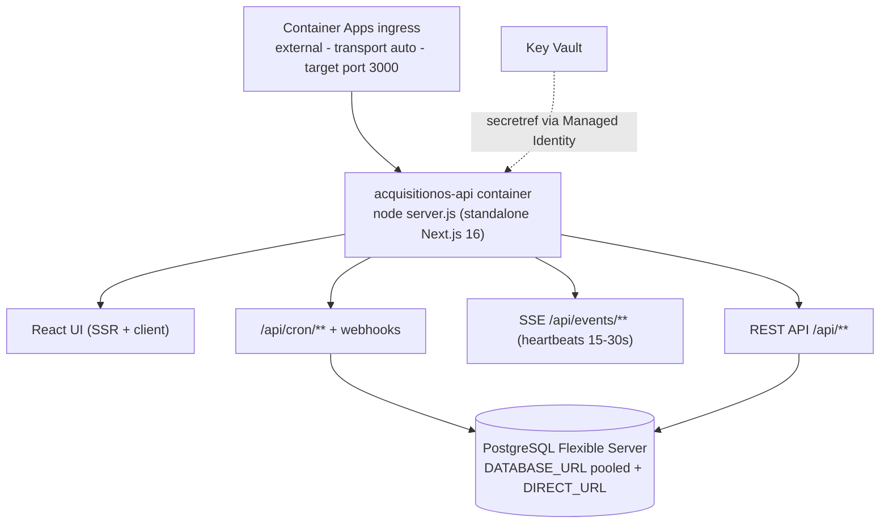

# Architecture on Azure — Mapping AcquisitionOS to Azure Services

This page explains **how the verified AcquisitionOS architecture** ([`../01-architecture.md`](../01-architecture.md)) maps onto Azure services, and the Azure-specific behaviors (SSE, headers, ingress) you must configure correctly. It complements `manual-deployment.md`, which shows the exact commands.

---

## 1. Component mapping

| AcquisitionOS need | Azure service | Label |
| --- | --- | --- |
| Host the single Next.js container (UI + API, port 3000) | **Azure Container Apps** (one app, e.g. `acquisitionos-api`) | REQUIRED |
| Store and serve the image | **Azure Container Registry** (Basic SKU is fine) | REQUIRED |
| Production PostgreSQL for Prisma (53+ models) | **Azure Database for PostgreSQL Flexible Server** | REQUIRED |
| Secret storage (`JWT_SECRET`, `DATABASE_URL`, provider keys) | **Azure Key Vault**, referenced by the app via `secretref` | REQUIRED |
| Secret delivery without baked credentials | **System-assigned Managed Identity** on the Container App + `Key Vault Secrets User` role | REQUIRED |
| External scheduler for 15 cron endpoints | **Azure Functions timer trigger** (simplest) or **Container Apps Job** | REQUIRED (pick one) |
| DNS for `app.yourdomain.com` | **Azure DNS** zone (or any DNS provider) | REQUIRED |
| TLS certificate | Managed certificate on Container Apps (or Front Door) | REQUIRED |
| Global edge / CDN in front of the app | **Azure Front Door** (caching disabled for `/api/events/*`) | OPTIONAL |
| Log streaming + metrics | **Log Analytics** (Container Apps console logs) | REQUIRED |
| Traces / APM | **Application Insights** via the app's OpenTelemetry OTLP export (`OTEL_*`) | OPTIONAL |
| Cross-instance SSE fan-out | **Azure Cache for Redis** via `REDIS_URL` | OPTIONAL |
| Durable uploads (`public/feedback-uploads/`, `public/invoices/`) | **Azure Blob Storage** (needs an integration; the app writes to local disk today) | OPTIONAL |
| Kubernetes | **AKS** — one container does not need it | FUTURE/ALTERNATIVE |
| Message queue | **Service Bus / Storage Queues** — jobs run in-process + HTTP cron | FUTURE/ALTERNATIVE |
| App sign-in via Microsoft Entra ID | Not used — AcquisitionOS ships its own JWT auth (`src/lib/auth.ts`); Entra ID only governs *your* Azure access | Not applicable |

---

## 2. The one-container rule on Azure

AcquisitionOS is **one deployable unit**. On Azure that is **one Container App**:

- **Target port:** 3000 (`--target-port 3000`). The Dockerfile exposes 3000 and binds `0.0.0.0` (see [`../03-docker.md`](../03-docker.md)).
- **One app, not two.** Do not split a `frontend` app and a `backend` app — the UI renders API data in-process. An `api.` subdomain split is possible but unnecessary (see [`../06-dns-and-domains.md`](../06-dns-and-domains.md) §3).
- **Revisions:** every `az containerapp update` creates a new revision; the old revision stays available for instant rollback (see `rollback.md` in this folder and `frontend.md` §6).

---

## 3. SSE (Server-Sent Events) on Container Apps

AcquisitionOS streams real-time updates from `/api/events/{notifications,payments,analytics,messages,workflows,ai}` with heartbeats every **15–30 s** and `Last-Event-ID` replay via `/api/realtime/recover`. On Azure, four settings keep SSE healthy:

| Setting | Value | Why |
| --- | --- | --- |
| Ingress transport | `auto` (`--transport auto`) | `auto` accepts HTTP/1.1 and HTTP/2 — no protocol mismatch for long-lived streams. REQUIRED for current AcquisitionOS. |
| Response compression | **Off** for SSE routes (Container Apps response compression is disabled by default — leave it off globally, or verify `/api/events/*` bypasses it. NEEDS VERIFICATION for per-route exclusion) | Compressed/buffered responses delay or break streamed events. The app already sets appropriate headers on SSE routes. |
| Replicas | `--min-replicas 1` (autoscale may raise it) | A scaled-to-zero app kills live streams and delays reconnection. REQUIRED. |
| Timeouts | Container Apps does not expose a per-revision HTTP idle-timeout knob (NEEDS VERIFICATION for current platform limits). With 15–30 s heartbeats, streams stay well inside platform limits. If you add Front Door, set its origin response timeout high enough (see [`networking.md`](./networking.md) §6). | Heartbeats are the app's keepalive; do not remove them. |

Also note: **without** `REDIS_URL`, events fan out only within a single replica. With `--min-replicas 1` and low/medium traffic that is fine. If you scale above 1 replica and users report missed live updates, add Azure Cache for Redis and set `REDIS_URL` (OPTIONAL).

---

## 4. Public URLs and proxy headers (the `app-url.ts` contract)

Magic links, OAuth redirects, and webhook-visible URLs are built in `src/lib/app-url.ts` from, in order: `X-Forwarded-Host` + `X-Forwarded-Proto` → Origin/Referer/Host → `APP_PUBLIC_URL` → `NEXT_PUBLIC_APP_URL` → legacy fallback. Consequences on Azure:

- **Set both** `APP_PUBLIC_URL=https://app.yourdomain.com` and `NEXT_PUBLIC_APP_URL=https://app.yourdomain.com`. `NEXT_PUBLIC_APP_URL` is inlined at **build time** — bake it into the image (see [`frontend.md`](./frontend.md) §2).
- Container Apps terminates TLS at its ingress and forwards the original `Host` plus `X-Forwarded-Proto: https` — the contract holds in the direct path. With **Front Door** in front, verify the forwarded host header equals your custom domain after binding it (Front Door forwards `X-Forwarded-Host`; Container Apps ingress forwards host headers it receives — confirm once with a temporary log or a debug route; NEEDS VERIFICATION if you change default routing).
- Never set the URL vars to `localhost` in production — the app's own `env-safeguard.ts` flags that combination.

---

## 5. What AcquisitionOS does **not** need on Azure

Do **not** provision any of this for the current app:

- **AKS / Kubernetes** — `deploy/k8s/*` in the repo is a legacy template that does not match this Next.js app. FUTURE/ALTERNATIVE.
- **Service Bus / Storage Queues / Event Hubs** — there is no queue consumer in the code. Jobs run in-process and through HTTP cron. FUTURE/ALTERNATIVE.
- **Entra ID (Azure AD) login for the application** — auth is custom JWT + Google OAuth + email OTP/magic link. Entra ID is only for *your* Azure administration (RBAC on resources).
- **Azure API Management** — the Next.js server *is* the API.
- **VMs / App Service** — the container path (Container Apps) is the documented target.
- **In-app scheduler processes** — there is no worker/beat process; the 15 cron endpoints must be called externally (§6 of `manual-deployment.md`).

---

## 6. Label summary

| Azure resource | Label |
| --- | --- |
| Container App (`acquisitionos-api`, port 3000, min 1 replica) | REQUIRED FOR CURRENT ACQUISITIONOS |
| Container Apps environment + Log Analytics | REQUIRED FOR CURRENT ACQUISITIONOS |
| ACR + image push | REQUIRED FOR CURRENT ACQUISITIONOS |
| PostgreSQL Flexible Server (TLS, backups, `app_user`) | REQUIRED FOR CURRENT ACQUISITIONOS |
| Key Vault + Managed Identity + secretref secrets | REQUIRED FOR CURRENT ACQUISITIONOS |
| Functions timer trigger or Container Apps Job (15 endpoints) | REQUIRED FOR CURRENT ACQUISITIONOS |
| Azure DNS zone + custom domain + managed certificate | REQUIRED FOR CURRENT ACQUISITIONOS (DNS may live at your registrar) |
| Azure Front Door | OPTIONAL |
| Application Insights (OTLP from the app) | OPTIONAL |
| Azure Cache for Redis (`REDIS_URL`) | OPTIONAL |
| Blob Storage for uploads | OPTIONAL (hardening; code writes to local disk today) |
| AKS, Service Bus, API Management, Entra ID app sign-in | FUTURE/ALTERNATIVE or not applicable — do not provision |

---

## 7. Official Documentation

- Container Apps concepts (environment, ingress, revisions) — https://learn.microsoft.com/azure/container-apps/
- Container Apps ingress & transport — https://learn.microsoft.com/azure/container-apps/ingress-overview
- PostgreSQL Flexible Server overview — https://learn.microsoft.com/azure/postgresql/flexible-server/
- Key Vault + Managed Identity for Container Apps — https://learn.microsoft.com/azure/container-apps/manage-secrets
- Azure Monitor / Log Analytics — https://learn.microsoft.com/azure/azure-monitor/
