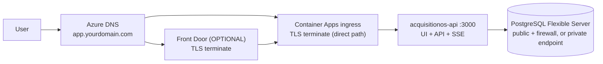

# Networking on Azure — VNet, Ingress, Front Door, Headers, TLS

How traffic reaches AcquisitionOS on Azure, and the two contracts you must not break: **SSE streaming** and **proxy header forwarding**. Commands assume the variables from `manual-deployment.md` §0.

---

## 1. The traffic path



By default the path is: Azure DNS (or your registrar) → Container Apps ingress → your container. Front Door is optional in front.

---

## 2. Container Apps networking and VNet integration

**What:** a Container Apps **environment** gives every app in it an ingress point and a default domain (`<app>.azurecontainerapps.io`). You can consume it in two modes:

- **Managed default networking** (this handbook's default): no VNet of yours to configure. Simplest; sufficient for most AcquisitionOS deployments.
- **Custom VNet integration** (`--infrastructure-subnet-resource-id` on the environment, or set later): the environment injects into your subnet. Choose this when you need the database reachable via a **private endpoint** (§3), or to control egress through a firewall.

**Why (for AcquisitionOS):** the simple mode works with the `azure-services` firewall rule on PostgreSQL. The VNet mode is the OPTIONAL hardening path — it unlocks private endpoints and Network Security Group control.

```bash
# Creating a VNet-integrated environment (OPTIONAL — replaces §5 of manual-deployment.md)
az network vnet create -g "$RG" -n vnet-acquisitionos \
  --address-prefix 10.0.0.0/16 --subnet-name snet-cae --subnet-prefix 10.0.0.0/23

az containerapp env create --name "$ENV_NAME" --resource-group "$RG" --location "$AZ_LOCATION" \
  --logs-workspace-id "$LAW_ID" --logs-workspace-key "$LAW_KEY" \
  --infrastructure-subnet-resource-id "$(az network vnet subnet show -g "$RG" --vnet-name vnet-acquisitionos -n snet-cae --query id -o tsv)"
```

The subnet must be **/23 or larger** and reserved exclusively for the environment (NEEDS VERIFICATION for current minimum sizing — the size cannot change after creation). Apps cannot be moved between environments: pick this mode *before* the first deploy if you want it.

**Verify:** `az containerapp env show -n "$ENV_NAME" -g "$RG" --query properties` shows `vnetConfiguration` when integrated.

---

## 3. PostgreSQL connectivity: public+firewall vs private endpoint

| Option | Setup | Who can reach the DB | Verdict |
| --- | --- | --- | --- |
| **Public access + firewall rules** (handbook default) | `--public-access` + rules for your IP and `0.0.0.0` (Azure services) | Your machine + any Azure-origin traffic | REQUIRED path for the simple deployment; security rests on TLS + strong password + least-privilege `app_user` |
| **Private endpoint + VNet-integrated Container Apps** (OPTIONAL hardening) | `public_network_access_enabled = false`; a private endpoint in your VNet; DNS private zone | Only resources inside the VNet | Best practice for regulated environments; needs the §2 VNet setup |

Private endpoint sketch (OPTIONAL):

```bash
az network private-endpoint create -g "$RG" -n pe-pg \
  --vnet-name vnet-acquisitionos --subnet snet-cae \
  --private-connection-resource-id "$(az postgres flexible-server show -g "$RG" -n "$PG" --query id -o tsv)" \
  --group-id postgresqlServer
# + a private DNS zone (privatelink.postgres.database.azure.com) linked to the VNet
```

**Verify (both options):** `psql "$DIRECT_URL" -c "select 1"` from an allowed machine; the app's `/api/health` reports `database: healthy`.

Do **not** forget: with public access, keep only the firewall rules you use, and rotate `DB_APP_PASSWORD` on any suspicion ([`secrets.md`](./secrets.md) §5).

---

## 4. Network Security Groups (NSG) basics

**What:** an NSG is a firewall attached to a subnet or NIC, with allow/deny rules.

**Why (for AcquisitionOS):** with the default managed networking you barely touch NSGs. With the VNet path you can, e.g., restrict the `snet-cae` subnet to only the ports Container Apps needs and deny the database subnet from the internet.

**Rules of thumb:**

- Container Apps manages its own environment networking — do not add NSG rules to the infrastructure subnet without reading the docs first (platform traffic can break; NEEDS VERIFICATION for the exact required rules per region).
- For a private-endpoint subnet: allow TCP 5432 from the VNet, deny everything else.
- NSG default rules already deny inbound internet; you usually only need to *allow* specific flows.

**Verify:** `az network nsg rule list --resource-group "$RG" --nsg-name YOUR_NSG -o table`.

---

## 5. Ingress modes for the app

**What:** the Container App's ingress configuration controls how external traffic reaches port 3000.

```bash
az containerapp ingress show -n "$APP" -g "$RG" --query "{fqdn: fqdn, transport: transport, external: external, targetPort: targetPort}"
```

| Setting | Value | Reason |
| --- | --- | --- |
| `external_enabled` | `true` | Users, webhooks, and the scheduler must reach the app |
| `target_port` | `3000` | The Next.js standalone server listens there |
| `transport` | `auto` | Accepts HTTP/1.1 and HTTP/2; required for correct SSE behavior ([`architecture.md`](./architecture.md) §3) |
| Session affinity | Off by default | SSE clients reconnect with `Last-Event-ID`; sticky sessions are not required (OPTIONAL if you later see reconnect storms across replicas) |

Container Apps **terminates TLS at the ingress** and forwards plain HTTP to the container inside the platform boundary; certificates attach to your custom hostname (§8).

---

## 6. SSE at the edge (Front Door and friends)

**Why:** `/api/events/*` are long-lived streamed responses with 15–30 s heartbeats. Any component that *buffers* or *caches* them breaks real-time updates (events arrive late or not at all).

**On Container Apps directly:** the ingress streams responses; response compression is off by default — leave it off for SSE routes (see [`architecture.md`](./architecture.md) §3).

**With Azure Front Door in front (OPTIONAL):**

1. **Disable caching** on the route(s) matching `/api/events/*` (and, per `manual-deployment.md` §8.3, simplest is caching disabled globally — the app sets its own `Cache-Control` headers; see [`frontend.md`](./frontend.md) §3).
2. **Response buffering:** Front Door streams responses end-to-end; there is no buffering toggle to set. Confirm behavior against current docs (NEEDS VERIFICATION) — the observable test in §9 is what actually matters.
3. **Timeouts:** set the origin response timeout as high as allowed (up to ~240 s) so a slow first byte never truncates a stream; heartbeats keep the connection alive after that.
4. **Health probes:** point the origin group's probe at `GET /api/health` (path `/api/health`, port 443). `/api/health` is the only unauthenticated health endpoint — use it for every probe ([`../01-architecture.md`](../01-architecture.md) §1).

**Verify an SSE stream end to end:**

```bash
curl -N -H "Cookie: <paste-auth-cookie-from-browser>" \
  "https://app.yourdomain.com/api/events/notifications"
# expect: headers (Content-Type: text/event-stream), then a comment/heartbeat line every 15-30s
```

If lines arrive in bursts every few minutes instead of streaming, something in the chain is buffering — that is your debug target.

---

## 7. TLS termination

- **Direct path:** the managed certificate on the Container App custom domain terminates TLS at the ingress (§8).
- **Front Door path:** TLS terminates at Front Door; the origin connection to Container Apps uses `forwarding-protocol HttpsOnly` so it is encrypted end to end (the Container App presents its own certificate).
- Cookies in production are `secure` — the app must be reached over HTTPS everywhere, including your scheduler and webhooks.

**Verify:** `curl -I https://app.yourdomain.com` shows a valid certificate chain and `HTTP/2 200` (or 307); no mixed-content warnings in the browser.

---

## 8. Header forwarding — the `app-url.ts` contract (critical)

`src/lib/app-url.ts` builds magic links, OAuth redirects, and printed URLs from, in order: `X-Forwarded-Host` + `X-Forwarded-Proto` → Origin → Referer → Host → `APP_PUBLIC_URL` → `NEXT_PUBLIC_APP_URL` → legacy fallback. Two Azure facts matter:

- **Container Apps ingress preserves the original `Host` header** and sets `X-Forwarded-Proto: https` when TLS terminated at the edge. The contract holds by default on the direct path.
- **Front Door** adds/forwards its own forwarding headers (`X-Forwarded-Host`, `X-Forwarded-Proto`) and forwards the request host as configured. After binding your custom domain, verify the app *sees* `app.yourdomain.com` (a one-off log line or a temporary debug route will show it — NEEDS VERIFICATION for exact header values; confirm once and document it).

**What you must do regardless of path:**

```bash
APP_PUBLIC_URL=https://app.yourdomain.com     # deterministic fallback (server)
NEXT_PUBLIC_APP_URL=https://app.yourdomain.com  # build-time (client) — baked into the image
```

**Verify:** request a magic link, open the email — the link must point at `https://app.yourdomain.com/...` (never `localhost`, never the legacy fallback domain, never the `azurecontainerapps.io` host unless that is your chosen public URL).

---

## 9. Custom domain + managed certificate on Container Apps

1. Add the hostname: `az containerapp hostname add --name "$APP" -g "$RG" --hostname "$APP_FQDN"`.
2. Read the verification id: `az containerapp show ... --query properties.configuration.ingress.customDomainVerificationId`.
3. In the DNS zone create:
   - **TXT** `asuid.app` → the verification id (proves domain ownership),
   - **CNAME** `app` → `<APP>.azurecontainerapps.io`.
4. Portal → Container App → **Custom domains** → the hostname → **Managed certificate** → wait for `Issued` (free, auto-renews; requires DNS to already resolve — that is why the CNAME comes first).
5. Re-check `APP_PUBLIC_URL` matches the bound hostname.

**Verify:**

```bash
dig app.yourdomain.com +short                  # CNAME target
curl -s "https://app.yourdomain.com/api/health"   # 200 over valid TLS
```

Full DNS background and the apex-vs-`www` pattern: [`../06-dns-and-domains.md`](../06-dns-and-domains.md) and `dns-ssl.md`.

---

## 10. Networking checklist

```text
[ ] Environment mode chosen (managed default vs VNet) BEFORE first deploy
[ ] PostgreSQL reachable only via chosen option; /api/health database healthy
[ ] Ingress: external, target port 3000, transport auto
[ ] SSE route test streams with 15-30s heartbeats end to end
[ ] If Front Door: caching disabled on /api/events/* (or globally), origin timeout raised, probe /api/health
[ ] Host + X-Forwarded-Proto verified; APP_PUBLIC_URL/NEXT_PUBLIC_APP_URL set
[ ] Custom domain bound; managed certificate Issued; cert auto-renew (managed)
[ ] NSG rules only where the VNet path is used; no rule breaks platform traffic
```

## 11. Official Documentation

- Container Apps networking — https://learn.microsoft.com/azure/container-apps/networking
- VNet integration & egress — https://learn.microsoft.com/azure/container-apps/vnet-custom-aks-support (see the networking section index under learn.microsoft.com/azure/container-apps/)
- Ingress overview (transport, TLS) — https://learn.microsoft.com/azure/container-apps/ingress-overview
- Managed certificates — https://learn.microsoft.com/azure/container-apps/custom-domains-managed-certificates
- Private endpoints for PostgreSQL Flexible Server — https://learn.microsoft.com/azure/postgresql/flexible-server/concepts-networking
- Azure Front Door — https://learn.microsoft.com/azure/frontdoor/
