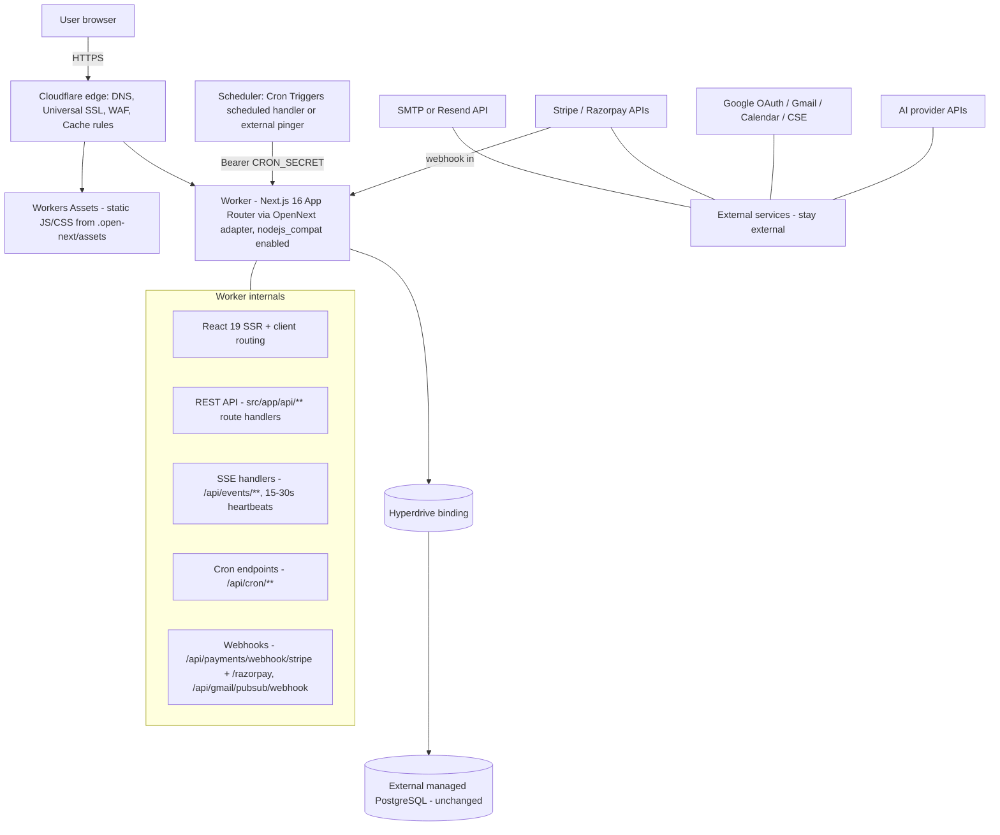

# Architecture on Cloudflare — Honest Mapping

This page maps the verified AcquisitionOS architecture (see [`../01-architecture.md`](../01-architecture.md)) onto Cloudflare's platform, states every runtime constraint plainly, and lists the options that are **rejected or deferred** — so you never discover them at 2 a.m. in production.

The one-paragraph summary: **the entire Next.js application (UI + API + SSE + webhooks + cron endpoints) runs as a single Cloudflare Worker produced by the OpenNext Cloudflare adapter; static files are served by Workers Assets; the PostgreSQL database and every third-party integration stay exactly where they are on the other clouds; Hyperdrive is the only Cloudflare-native piece in the data path.**

---

## 1. What runs on Cloudflare vs what stays external



| Concern | Runs where | Label |
| --- | --- | --- |
| React UI rendering (SSR + client bundle) | Worker (SSR) + Workers Assets (static chunks) | `REQUIRED FOR CURRENT ACQUISITIONOS` |
| `/api/**` REST route handlers | Same Worker | `REQUIRED` |
| SSE endpoints `/api/events/**` | Same Worker, streamed response | `REQUIRED` |
| `/api/health` (+ detailed/database variants) | Same Worker | `REQUIRED` for monitoring probes |
| Auth (JWT cookies, bcrypt, OTP/magic link, Google OAuth) | Same Worker; `nodejs_compat` covers `node:crypto` used by `jose`/`bcryptjs` | `REQUIRED` |
| PostgreSQL database engine | **External managed provider** (Neon, Supabase, RDS, Cloud SQL, Azure Flexible Server, ...) | `REQUIRED` — never D1 (see §4) |
| Connection pooling for Postgres | Hyperdrive (Cloudflare) at the edge | `REQUIRED` |
| Prisma migrations (`db push` / `migrate`) | Run from CI/local over the **direct** connection (`DIRECT_URL`), not through Hyperdrive | `REQUIRED` |
| Outbound email | Resend HTTP API (recommended on Workers) or SMTP provider | `REQUIRED` for email auth |
| Payments (Stripe, Razorpay) | Provider APIs; webhooks inbound to the Worker | `REQUIRED` for billing |
| Google OAuth / Gmail / Calendar / Custom Search | Google APIs; inbound Pub/Sub push optional | `REQUIRED` for those features |
| AI providers | Provider HTTP APIs (server-side only) | `REQUIRED` in external production |
| Object storage for uploads/invoices | R2 bucket (binding) — **code changes required to use it** | `OPTIONAL` |
| Cross-instance SSE fan-out | Upstash Redis via `REDIS_URL` (same code path as other clouds) | `OPTIONAL` |
| Scheduler for the 15 cron endpoints | Workers Cron Triggers (scheduled handler) or external pinger | `REQUIRED` |
| WAF, rate limiting, bot management | Cloudflare WAF / zone-level rules | `RECOMMENDED` (security hardening) |

---

## 2. Runtime constraint table (the honest part)

These constraints come from the Workers runtime (`workerd`) and the OpenNext adapter, verified against the official documentation at the time of writing (https://developers.cloudflare.com/workers/platform/limits/, https://opennext.js.org/cloudflare). **Both pages change over time — re-verify anything marked `NEEDS VERIFICATION` before you commit to this platform.**

| Constraint | What the docs say | Impact on AcquisitionOS | Severity |
| --- | --- | --- | --- |
| Node.js compatibility | The Worker must set `compatibility_flags = ["nodejs_compat"]` and `compatibility_date` ≥ the date the adapter requires (≥ 2024-09-23 at the time of writing). A large Node-API subset is provided (`node:buffer`, `node:crypto`, `node:stream`, `node:path`, ...), but some APIs are missing or behave differently. | `bcryptjs`, `jose`, Prisma, and nodemailer-style code generally work; anything using native addons or deep Node internals is the risk area. Test every feature in §5. | High — mandatory config |
| CPU time per request | Workers Free: **10 ms**; Workers Paid: **5 min cap (30 s default)**. Memory 128 MB on both. (Figures as documented at the time of writing — `NEEDS VERIFICATION`.) | SSR + Prisma + bcrypt + AI calls routinely exceed 10 ms. **Workers Paid is effectively required.** | High |
| Wall-clock duration (HTTP) | At the time of writing: *no hard limit while the client remains connected*; a Worker streaming a response body stays active. (`NEEDS VERIFICATION` — re-check the limits page for your plan.) | Good news for SSE: heartbeats every 15–30 s keep clients connected indefinitely. | Low (favorable) |
| Simultaneous outgoing connections | 6 per request (both plans, at the time of writing). | A single request that opens DB + AI + email + search connections concurrently can brush this limit. Usually fine; watch `wrangler tail` for `too many simultaneous connections`. | Medium |
| Subrequests per invocation | 50/request on Free, 10,000 on Paid. | Batch endpoints (discovery, outreach) that fan out to external APIs are safer on Paid. | Medium |
| Worker size | 64 MiB compressed at the time of writing. | The app is large (60+ route groups); OpenNext outputs one bundle. If you hit the cap, split routes or use the adapter's size guidance. `NEEDS VERIFICATION` for current figures. | Medium |
| Image optimization | Next.js `<Image>` optimization runs sharp-like image processing. On Workers it is **not** automatic: OpenNext documents a Cloudflare Images integration (via the `images` binding) or alternative loaders as the supported paths (https://opennext.js.org/cloudflare/howtos/image). | Options: (a) Cloudflare Images binding, (b) external loader / CDN-based loader, (c) `images.unoptimized = true`. Trade-offs in [`frontend.md`](./frontend.md) §4. | High if you use `next/image` |
| `output: 'standalone'` vs adapter build | The Docker-oriented standalone output (`.next/standalone/server.js`) is **ignored** on this path; OpenNext runs its own build step that consumes the Next build output and emits `.open-next/worker.js`. | Keep `output: 'standalone'` in `next.config.ts` — it does not conflict with the adapter and keeps the Docker/local path working. The adapter decides what to run. | Low (confusion risk) |
| Prisma client | OpenNext requires: `previewFeatures = ["driverAdapters"]`, **no** custom `output` dir on the generator, `@prisma/adapter-pg` (PrismaPg) at runtime, and a **per-request** client (`maxUses: 1`) — a global pooled client is explicitly unsupported (https://opennext.js.org/cloudflare/howtos/db). | The app's `src/lib/db.ts` global client must be adapted when choosing this platform. Migration commands still run via `DIRECT_URL` off-platform. See [`database.md`](./database.md) §4. | High |
| Ephemeral filesystem | Workers has no writable persistent disk at all (more restrictive than an ephemeral container volume). | `public/feedback-uploads/` and `public/invoices/` writes vanish. PDF invoice generation via `pdfkit` (Node streams) needs explicit testing on Workers — `NEEDS VERIFICATION`; R2 integration is the durable fix. | High for those features |
| Outbound SMTP | Workers can open TCP, but running a raw SMTP conversation from Workers is unreliable/undocumented territory. | Use **Resend's HTTP API** (`RESEND_API_KEY`) — the app already supports it — or an external mail relay with an HTTPS API. Be honest: nodemailer SMTP from Workers is not the recommended path. | High for email auth |
| Global state / singletons | Isolates may be evicted at any time; nothing in memory is durable. | The in-process SSE bus and in-memory caches behave like a container that restarts constantly. Single-instance behavior still works (like other clouds without Redis); multi-instance fan-out uses `REDIS_URL` (Upstash) as elsewhere. | Medium |

---

## 3. What the deployment looks like (contrast with the container clouds)

```text
Container clouds (GCP/AWS/Azure)          Cloudflare (this guide)
-----------------------------------       -----------------------------------
Dockerfile -> image -> registry           opennextjs-cloudflare build
Deploy container to managed runtime   ->  opennextjs-cloudflare deploy  (Worker + assets)
LB / CDN in front                         Cloudflare edge IS the front (WAF/SSL/CDN built in)
Postgres managed service                  Postgres managed service (external, same options)
DB client: DATABASE_URL (pooler)          DB client: Hyperdrive connection string
Secrets -> env vars in task def           Secrets -> wrangler secret put
Cron: Cloud Scheduler / EventBridge       Cron: Workers Cron Triggers scheduled handler
Rollback: redeploy previous image         Rollback: Workers Versions instant rollback
```

The right-hand column has fewer infrastructure primitives but one more build-time abstraction (the adapter). That is the core trade of this platform.

### 3.1 One request, end to end (what actually happens)

Walking a single login request through the platform makes the mapping concrete:

1. Browser resolves `app.yourdomain.com` via Cloudflare DNS; TLS terminates at the edge (Universal SSL).
2. WAF and Cache Rules evaluate the request (challenge, rate limit, or cache bypass for `/api/*`).
3. Because the hostname is a Worker Custom Domain, the request goes to your Worker; static-file requests (`/_next/static/**`) are answered by Workers Assets without executing the Worker.
4. The OpenNext-converted Next.js server handles `POST /api/auth/signin`: verifies credentials with `bcryptjs`, queries the user via the Hyperdrive-bound Prisma client, and sets JWT cookies (`jose`).
5. All of this must fit the plan's CPU-time budget (§2) — network waits (Postgres) do not count, CPU work does.

Every other flow (SSE stream, webhook POST, cron fetch) is the same path with a different handler at step 4 — which is why the platform choice concentrates risk in exactly two places: the adapter's fidelity to Next.js, and the runtime limits table below.

---

## 4. Options evaluated and REJECTED / deferred

Be suspicious of any guide that silently omits these. Here they are, explicitly:

| Option | Verdict | Why |
| --- | --- | --- |
| **D1 (Cloudflare SQLite)** | **`NOT APPLICABLE` — rejected** | AcquisitionOS uses Prisma 6 with a PostgreSQL provider (`prisma/schema.production.prisma`, 53+ models). D1 is SQLite. "Migrating" would mean rewriting the schema, all raw SQL, and re-validating every query — a project, not a deployment step. The handbook position (per [`../README.md`](../README.md) §5) is fixed: **keep external PostgreSQL via Hyperdrive; never migrate to D1.** |
| **Prisma Accelerate (managed connection pool/proxy)** | `OPTIONAL` alternative to Hyperdrive | Accelerate can serve the same "pooled connection" role for Prisma. If you use Hyperdrive you do not need Accelerate. If you later adopt driver adapters fully, evaluate both — pricing and latency differ. `NEEDS VERIFICATION` against current Prisma docs (https://www.prisma.io/docs) before choosing. |
| **Prisma driver adapters beyond pg** | `NEEDS VERIFICATION` | Prisma's Cloudflare/Workers guidance evolves; the OpenNext docs currently demonstrate `@prisma/adapter-pg` against Hyperdrive. Verify the current recommended adapter in the Prisma docs and the OpenNext Database & ORM how-to before coding. |
| **Workers Queues** | `FUTURE/ALTERNATIVE` | AcquisitionOS has no queue consumer; jobs run in-process and via HTTP cron. Adopting Queues would be an application change, not a deployment setting. |
| **Durable Objects** | `FUTURE/ALTERNATIVE` | Attractive future home for the SSE fan-out bus (single coordinated point) — but the current code knows nothing about DOs. Not used today. |
| **Workers KV** | `FUTURE/ALTERNATIVE` (caching only) | Could back a future cache layer, but the app's optional cache path today is Redis (`REDIS_URL`). |
| **Cloudflare Containers (Containers-based Workers)** | `FUTURE/ALTERNATIVE` — `NEEDS VERIFICATION` | If OpenNext limits ever become a blocker (e.g., native-module PDF generation), a container-based Workers option would let the standard Node runtime run on Cloudflare. Availability/limits are recent and changing — check https://developers.cloudflare.com/containers/ (or the current equivalent) before relying on it. Not part of this guide's main path. |
| **`@cloudflare/next-on-pages`** | **Rejected** | The legacy Edge-runtime adapter. OpenNext (`@opennextjs/cloudflare`) is the supported path for Node-runtime Next.js apps like this one; the adapter docs are explicit about the difference. Do not mix the two. |

---

## 5. What stays identical to the other clouds (portability anchor)

1. **Database schema and migrations** — `prisma/schema.production.prisma` (PostgreSQL, `url = DATABASE_URL`, `directUrl = DIRECT_URL`) is used verbatim. Migrations run with the same commands documented in [`../../04-database-production.md`](../04-database-production.md).
2. **Environment variables** — the entire inventory in [`../02-environment-variables-and-secrets.md`](../02-environment-variables-and-secrets.md) applies unchanged; only the storage mechanism differs (wrangler secrets instead of a container platform's secret manager) — see [`secrets.md`](./secrets.md).
3. **Public URL resolution** — `src/lib/app-url.ts` still reads `x-forwarded-host` / `x-forwarded-proto` first, then `APP_PUBLIC_URL`. Workers with a Custom Domain passes the original host through; set `APP_PUBLIC_URL=https://app.yourdomain.com` anyway. Details in [`networking.md`](./networking.md) §5.
4. **Cron contract** — the same 15 endpoints with `Authorization: Bearer <CRON_SECRET>` ([`../01-architecture.md`](../01-architecture.md) §2.4); Cloudflare just becomes the caller.
5. **Webhook contract** — Stripe signs and POSTs to `/api/payments/webhook/stripe`, Razorpay to `/api/payments/webhook/razorpay`, exactly as before; signature verification runs in the Worker.
6. **Health checks** — `GET /api/health` remains the unauthenticated liveness probe (use it for uptime monitors; protect the `/detailed` and `/database` variants).
7. **The app is still ONE unit** — you never split UI and API on Cloudflare; the Worker serves both, which is exactly how the app was built.

---

## 6. Decision helper: is the Cloudflare path right for this app?

Choose Cloudflare when: global edge latency matters, traffic is bursty/low-volume (cost shape favors it), you accept the adapter abstraction, and your database can live with an edge-pooled connection (it can — Hyperdrive is designed for Postgres).

Prefer the container clouds (GCP/AWS/Azure) when: you want zero code-path changes (global Prisma client, sharp image processing, filesystem writes, raw SMTP), you need native modules with confidence, or your team already operates containers. The honest complexity comparison is in [`../01-architecture.md`](../01-architecture.md) §3 (Cloudflare scores "Medium — adapter layer + limits to understand").

Nothing prevents starting on a container cloud and moving to Cloudflare later: the database, env vars, webhooks, and cron contract are identical; only the build/deploy layer changes.

---

## 7. Official Documentation

- OpenNext Cloudflare adapter — overview & compatibility: https://opennext.js.org/cloudflare
- OpenNext Database & ORM how-to (Prisma on Workers): https://opennext.js.org/cloudflare/howtos/db
- OpenNext image optimization how-to: https://opennext.js.org/cloudflare/howtos/image
- Workers Node.js compatibility (supported APIs): https://developers.cloudflare.com/workers/runtime-apis/nodejs/
- Workers limits: https://developers.cloudflare.com/workers/platform/limits/
- Workers compatibility dates & flags: https://developers.cloudflare.com/workers/configuration/compatibility-dates/
- Hyperdrive: https://developers.cloudflare.com/hyperdrive/
- Prisma deployment/Cloudflare guidance: https://www.prisma.io/docs/orm/prisma-client/deployment
