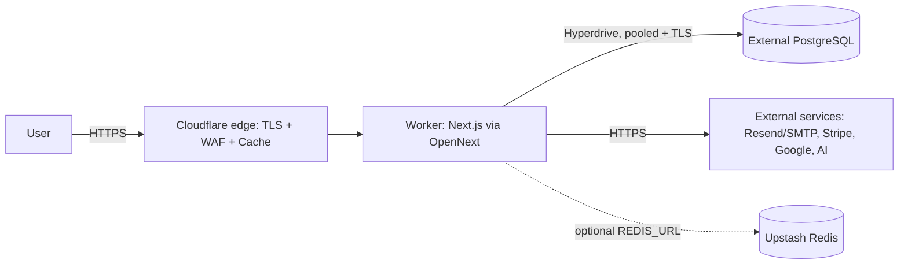

# Networking — Cloudflare Edge for AcquisitionOS

How traffic reaches AcquisitionOS on Cloudflare, what the edge does to it (TLS, headers, caching, WAF), and what the app needs preserved. The container-cloud equivalents (VPC, load balancer, idle timeouts) mostly **do not exist here** — this page explains what replaces them.

---

## 1. The edge model: there is no VPC

**What:** on GCP/AWS/Azure you build a network (VPC, subnets, security groups, load balancer) between the internet and your container. On Cloudflare there is **no VPC and no load balancer to configure**: the Worker runs *on* the Cloudflare edge in every region, and outbound connections (Postgres via Hyperdrive, Redis, SMTP/Resend, Stripe, Google, AI providers) leave the edge over the public internet with TLS.



**Consequences for AcquisitionOS:**

- No IP allow-listing of "app to database": the database must accept TLS connections from Cloudflare's network (Hyperdrive's egress). Managed Postgres providers are reached by hostname + `sslmode=require` — see [`database.md`](./database.md) §6.
- No private networking unless the provider supports it from Cloudflare (e.g., Hyperdrive's documented options — `NEEDS VERIFICATION` for current features such as private-database connectivity: https://developers.cloudflare.com/hyperdrive/).
- Health checks are not an LB concept anymore: monitor `/api/health` with an external uptime checker (`/api/health` is the unauthenticated probe — [`../01-architecture.md`](../01-architecture.md) §1).
- "Idle timeout" is not configurable because there is no LB to configure; SSE behavior is governed by Workers' streaming model (§5).

---

## 2. DNS zone setup

**What:** `yourdomain.com` on Cloudflare DNS (created in [`prerequisites.md`](./prerequisites.md) §2).
**Why:** Custom Domains, Universal SSL, and WAF only work for zones Cloudflare serves.

**Checklist:**

1. Zone **Active** (nameservers pointing at Cloudflare).
2. The only A/AAAA/CNAME for the app is the one the **Custom Domain** creates automatically (manual-deployment §10). Do not hand-create a second record for the same hostname — Cloudflare will refuse the duplicate.
3. Review imported records once: MX (mail), TXT (SPF/DKIM/verification) must be untouched — the app sends email via Resend/SMTP from your domain, and SPF/DKIM matter for OTP delivery ([`../02-environment-variables-and-secrets.md`](../02-environment-variables-and-secrets.md) §3).
4. No other record should point at the old deployment once migrated.

**Verify:** `dig app.yourdomain.com +short` returns Cloudflare-proxied addresses; `dig yourdomain.com NS +short` returns `*.ns.cloudflare.com`.

---

## 3. Universal SSL vs Advanced Certificate Manager

**What:**

| Option | What you get | When AcquisitionOS needs it |
| --- | --- | --- |
| **Universal SSL** (included, automatic) | Edge certificate for apex + `*.<zone>` first-level subdomains, auto-issued and renewed | Default. `app.yourdomain.com` is covered — nothing to buy or click beyond the Custom Domain. |
| **Advanced Certificate Manager (ACM)** (zone add-on) | Custom SANs, deeper subdomains, min TLS version control, custom certificate pack ordering | `OPTIONAL` — only if you need e.g. `api.staging.yourdomain.com`-style multi-level hosts or strict TLS settings per host. |

**Why it matters:** auth cookies are `secure` in production and OAuth/webhooks require valid HTTPS — the certificate must be live before go-live traffic. Universal SSL issuance happens automatically once the zone is active and the hostname is proxied.

**Verify:** browser padlock on `https://app.yourdomain.com`; certificate issuer is a Cloudflare-partner CA (e.g., "Google Trust Services"); https://developers.cloudflare.com/ssl/ for the current feature matrix.

---

## 4. Custom Domains for Workers and proxy status

**What:** a Workers **Custom Domain** binds `app.yourdomain.com` to the Worker. Cloudflare creates the DNS record **proxied (orange cloud)** automatically; traffic to that hostname terminates TLS at the edge and is routed to your Worker.

**Why the orange cloud matters:** an unproxied (grey cloud) record would bypass WAF, cache rules, and Custom Domain routing — the Worker would not receive the traffic. Keep it proxied.

**How to verify:**

```bash
curl -sI https://app.yourdomain.com/api/health | head -3
# expect: HTTP/2 200 (or HTTP/1.1 200) with Cloudflare server headers
```

Dashboard: zone → DNS → the app record shows the orange-cloud icon and notes it is managed by the Worker. Deeper routing options (Routes per path, e.g. `yourdomain.com/api/*`) exist, but for AcquisitionOS the whole hostname belongs to one Worker — Custom Domain is the right tool.

---

## 5. Host and forwarded headers (why `app-url.ts` keeps working)

**What:** [`../01-architecture.md`](../01-architecture.md) §2.2 documents that `src/lib/app-url.ts` resolves the public origin from `x-forwarded-host` + `x-forwarded-proto` first, then `APP_PUBLIC_URL`.

**How Cloudflare behaves:** with a Custom Domain, the Worker receives the **original request host** (`app.yourdomain.com`) as the `Host` header, and Cloudflare adds standard forwarded headers (`X-Forwarded-Proto: https`, `CF-Connecting-IP` for the client IP) for proxied HTTPS traffic. Magic links, OAuth redirects, and webhook-visible URLs therefore resolve correctly — provided you also set the env vars:

- `APP_PUBLIC_URL=https://app.yourdomain.com` (server-side override — in `wrangler.jsonc` `vars`)
- `NEXT_PUBLIC_APP_URL=https://app.yourdomain.com` (**build-time** — must be set when `opennextjs-cloudflare build` runs; see [`frontend.md`](./frontend.md) §2)

**Transform rules are usually NOT needed** on this platform precisely because Custom Domains preserve the original host. If you ever route through an intermediate hostname (rare; e.g., blue/green on separate hostnames), a Transform Rule can rewrite `X-Forwarded-Host` — but prefer keeping one hostname per environment (see [`frontend.md`](./frontend.md) §7) and avoid header surgery.

**Verify:**

```bash
curl -s https://app.yourdomain.com/api/auth/me -o /dev/null -w "%{http_code}\n"   # 401 expected, no redirect loops
# Trigger a magic-link email and confirm the link host is https://app.yourdomain.com
```

---

## 6. WAF: managed rules + custom rules

**What:** the zone's Web Application Firewall. Managed rulesets (Cloudflare's vetted signatures) apply by default per plan; **custom rules** let you write Cloudflare Rules expressions.
**Why (for AcquisitionOS):** `/api/auth/*` (login, OTP, magic link) and `/api/payments/webhook/*` are the classic abuse targets; rate-limit and challenge rules blunt credential stuffing without touching normal users.

**Recommended starting rules (tune before enabling; full syntax at https://developers.cloudflare.com/waf/):**

| Rule | Expression (shape) | Action |
| --- | --- | --- |
| Challenge suspicious API writes | `http.host eq "app.yourdomain.com" and starts_with(http.request.uri.path, "/api/") and http.request.method ne "GET"` | Managed challenge (only on score/abuse signals — use WAF managed rulesets rather than blanket challenges) |
| Rate limit auth endpoints | phase `http_ratelimit`: `starts_with(http.request.uri.path, "/api/auth/")` | Block when > N requests / minute / IP (start generous: login + OTP means bursts are normal) |
| Protect diagnostics | `starts_with(http.request.uri.path, "/api/health/detailed") or starts_with(http.request.uri.path, "/api/health/database")` | Block from public (or restrict to your IP) — [`../01-architecture.md`](../01-architecture.md) says keep these non-public |

**Caution — do not strangle SSE or webhooks:**

- `/api/events/*` are **one long-lived request each**, not many short ones; per-IP rate limits barely register, but avoid rules matching "high bytes" or "long duration".
- `/api/payments/webhook/*` and `/api/gmail/pubsub/webhook` come from provider IP ranges — exempt them from challenges or signature verification will still hold but deliveries may bounce.

**Verify:** send 100 rapid `POST /api/auth/signin` attempts in a test; observe 429/challenge responses; confirm normal login still works and webhook deliveries show `200` in `wrangler tail`. IaC form of these rules: [`terraform.md`](./terraform.md) §4.5.

---

## 7. SSE through the edge

**What:** `/api/events/**` (notifications, payments, analytics, messages, workflows, ai — [`../01-architecture.md`](../01-architecture.md) §2.3) stream from the Worker to the browser.
**Why this works on Workers:** the runtime streams responses as they are produced; at the time of writing the documented wall-time for an incoming HTTP request is **unlimited while the client remains connected** (a Worker still streaming a response body stays active) — `NEEDS VERIFICATION` before you rely on it; re-check https://developers.cloudflare.com/workers/platform/limits/.

**Behavior summary:**

- **Buffering:** not applied to streamed Worker responses — chunks (and the app's 15–30 s heartbeats) reach the client as sent. The "disable proxy buffering for `/api/events/*`" step from other clouds has no equivalent here; nothing to configure.
- **Heartbeats:** the app sends them every 15–30 s, keeping clients and any intermediary connections alive.
- **Reconnect:** `EventSource` auto-reconnects and the app replays missed events via `Last-Event-ID` (`/api/realtime/recover`) — brief edge hiccups self-heal.
- **Concurrency:** each SSE stream occupies one of the request's 6 simultaneous outgoing-connection slots only while the handler awaits upstream work; long-idle streams are cheap, but keep an eye on `wrangler tail` for connection-limit errors if a single request fans out heavily.

**Verify:** open the notifications bell in two browsers, keep one open > 10 minutes across multiple heartbeats, confirm live delivery and a clean reconnect after `npx wrangler deploy` (the stream should re-establish via EventSource's retry).

---

## 8. Caching: bypass `/api/*`, respect the app's headers

**What:** Cloudflare caches static content by default and leaves dynamic responses alone; Cache Rules (zone → Caching → Cache Rules) give explicit control.
**Why (for AcquisitionOS):**

1. **`/api/**` must never be cached** at the edge — auth, SSE, webhooks, cron endpoints are per-user/per-request. The app already sends `no-store`-style cache control on these routes; a **bypass-cache rule** guarantees the edge agrees even if a route ever forgets.
2. **Static assets are handled by Workers Assets** (`.open-next/assets`), which serves immutable `_next/static` files with hashed names and its own caching behavior (https://developers.cloudflare.com/workers/static-assets/) — no custom page rule needed.
3. **HTML/SSR responses:** let the app's `Cache-Control` headers govern them. Workers/CDN respect the headers the app sets (see [`frontend.md`](./frontend.md) §3 for the full caching story and where the Cache API fits).

**Rule to create (Cache Rule):**

| Field | Value |
| --- | --- |
| Match | `http.host eq "app.yourdomain.com" and starts_with(http.request.uri.path, "/api/")` |
| Cache eligibility | **Bypass cache** |

**Verify:**

```bash
curl -sD - -o /dev/null https://app.yourdomain.com/api/health | rg -i "cf-cache-status|cache-control"
# expect: no cf-cache-status HIT (bypass), plus the app's own no-store header
curl -sD - -o /dev/null https://app.yourdomain.com/ | rg -i "cf-cache-status|cache-control"   # HTML follows the app's headers
```

---

## 9. Quick reference: what you no longer configure

| Container-cloud task | Cloudflare equivalent |
| --- | --- |
| Create VPC/subnets | Nothing — edge model (§1) |
| Configure LB listener + TLS cert | Custom Domain + Universal SSL (§3–4) |
| Raise LB idle timeout to ≥ 120 s for SSE | Nothing — streaming model (§7) |
| Disable proxy buffering for `/api/events/*` | Nothing — not applied (§7) |
| Health-check probes on the LB | External uptime monitor on `/api/health` (§1) |
| WAF security groups | Cloudflare WAF rulesets (§6) |
| CDN cache invalidation rules | Cache Rules + app headers (§8) |

---

## 10. Official Documentation

- DNS — https://developers.cloudflare.com/dns/
- SSL — https://developers.cloudflare.com/ssl/ (Universal SSL + ACM)
- Workers Custom Domains & Routes — https://developers.cloudflare.com/workers/configuration/routing/custom-domains/
- Workers Static Assets — https://developers.cloudflare.com/workers/static-assets/
- WAF — https://developers.cloudflare.com/waf/
- Rate limiting rules — https://developers.cloudflare.com/waf/rate-limiting-rules/
- Transform Rules — https://developers.cloudflare.com/rules/transform/
- Cache Rules — https://developers.cloudflare.com/cache/how-to/cache-rules/
- Workers limits (duration/streaming) — https://developers.cloudflare.com/workers/platform/limits/
