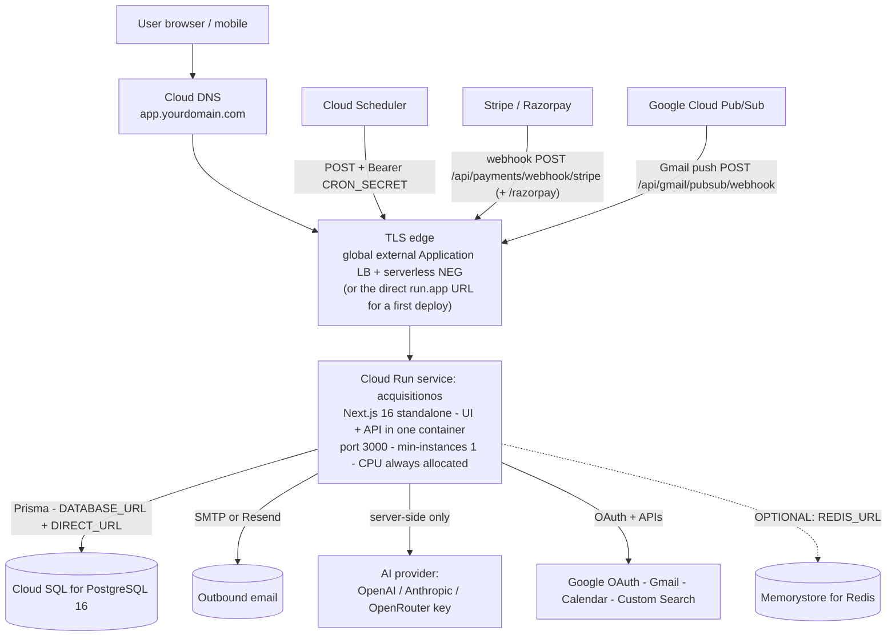

# Deploying AcquisitionOS on Google Cloud Platform (GCP)

**Audience:** engineers deploying AcquisitionOS to GCP, including readers with little or no prior cloud experience. Every command is explained (What → Why → Command → Expected output → Verify), and every GCP service is labeled exactly as in the handbook: `REQUIRED FOR CURRENT ACQUISITIONOS`, `OPTIONAL`, or `FUTURE/ALTERNATIVE`.

**The 30-second version:** AcquisitionOS is **one Next.js 16 container** (UI + API together, port 3000). On GCP it runs on **Cloud Run**, talks to **Cloud SQL for PostgreSQL**, reads secrets from **Secret Manager**, is triggered on schedule by **Cloud Scheduler**, and is exposed through **Cloud DNS** plus a TLS edge (global external Application Load Balancer, or the plain `run.app` URL for your first deploy).

> This guide describes the real application — every statement was verified against this repository. Anything not part of AcquisitionOS today is explicitly labeled; anything unverifiable is marked `NEEDS VERIFICATION`. GCP-specific facts are cross-checked against the official documentation linked at the bottom.

---

## 1. What this guide covers

| Page | What it gives you |
| --- | --- |
| [`architecture.md`](./architecture.md) | How AcquisitionOS maps onto GCP services, verified facts table, what you do **not** need, SSE settings |
| [`prerequisites.md`](./prerequisites.md) | GCP account, organization vs personal account, project, billing alerts, gcloud CLI, APIs, quotas, region choice |
| [`manual-deployment.md`](./manual-deployment.md) | **The core walkthrough** — click-by-click, command-by-command production deploy |
| [`terraform.md`](./terraform.md) | Infrastructure as Code: full Terraform setup, state, environments, CI/CD safety |
| [`networking.md`](./networking.md) | Load balancer, serverless NEG, managed TLS, Direct VPC egress, SSE timeout/header requirements |
| [`database.md`](./database.md) | Cloud SQL for PostgreSQL: creation, flags, users, HA, backups/PITR, connection budget |
| [`secrets.md`](./secrets.md) | Secret Manager: every AcquisitionOS variable, rotation, IAM, what never goes in Git |
| [`frontend.md`](./frontend.md) | The Next.js UI on Cloud Run: build-time vs runtime vars, caching, custom domains, staging |

The remaining companion pages of this folder (`backend.md`, `dns-ssl.md`, `cicd.md`, `monitoring.md`, `backups.md`, `security.md`, `scaling.md`, `rollback.md`, `troubleshooting.md`) complete the guide — see the handbook folder map in [`../../README.md`](../README.md#3-folder-map).

**Reading order for beginners:** `prerequisites.md` → `architecture.md` → `manual-deployment.md` (deploy by hand once) → `terraform.md` (automate the infrastructure) → the topic pages as needed.

---

## 2. Component map — which GCP service fills each AcquisitionOS need

| AcquisitionOS need | GCP service | Label |
| --- | --- | --- |
| Next.js UI + REST API + SSE + cron endpoints (one container, port 3000) | **Cloud Run** | `REQUIRED FOR CURRENT ACQUISITIONOS` |
| PostgreSQL database (Prisma, 53+ models) | **Cloud SQL for PostgreSQL 16** | `REQUIRED FOR CURRENT ACQUISITIONOS` |
| Secret storage (`JWT_SECRET`, `DATABASE_URL`, payment/AI keys) | **Secret Manager** | `REQUIRED FOR CURRENT ACQUISITIONOS` |
| Container image registry | **Artifact Registry** (Docker format) | `REQUIRED FOR CURRENT ACQUISITIONOS` |
| External scheduler for `/api/cron/*` (no in-app scheduler exists) | **Cloud Scheduler** | `REQUIRED FOR CURRENT ACQUISITIONOS` |
| DNS zone + records for `app.yourdomain.com` | **Cloud DNS** | `REQUIRED FOR CURRENT ACQUISITIONOS` (or keep DNS at your registrar) |
| TLS certificate | **Certificate Manager** (Google-managed, via LB or domain mapping) | `REQUIRED FOR CURRENT ACQUISITIONOS` |
| Container build | **Cloud Build** (optional — any Docker host works) | `OPTIONAL` |
| Global edge + optional CDN | **Global external Application Load Balancer** + serverless NEG | `OPTIONAL` (simple start: direct `run.app` URL / domain mapping) |
| Web Application Firewall | **Cloud Armor** (in front of the LB) | `OPTIONAL` |
| Runtime logs, metrics, alerts | **Cloud Logging + Cloud Monitoring** | `OPTIONAL` (enabled by default; alerts recommended) |
| Gmail push notifications (`GMAIL_PUBSUB_*`) | **Pub/Sub** | `OPTIONAL` (feature-level; cron fallback exists) |
| Cross-instance SSE fan-out (`REDIS_URL`) | **Memorystore for Redis** | `OPTIONAL` |
| Durable storage for `public/` uploads | **Cloud Storage** | `OPTIONAL` |
| Terraform provider | `google` (registry.terraform.io/providers/hashicorp/google) | `REQUIRED` if you adopt IaC |
| Kubernetes (GKE) | — | `FUTURE/ALTERNATIVE` — **not needed** |
| Message queues (Pub/Sub queues as job workers, Kafka) | — | `FUTURE/ALTERNATIVE` — **not needed** |

---

## 3. High-level architecture



Three platform facts that shape everything (verified against the app, detailed in [`architecture.md`](./architecture.md)):

1. **SSE** (`/api/events/*`, heartbeats every 15–30 s): Cloud Run needs `min-instances=1`, CPU allocated even when idle, and request timeout ≥ 3600 s for `/api/events`; if you put a load balancer in front, its timeout must be ≥ 120 s (default 30 s is too low) and buffering must be off.
2. **Public URLs** (`src/lib/app-url.ts`): set `APP_PUBLIC_URL` + `NEXT_PUBLIC_APP_URL` and forward `Host` + `X-Forwarded-Proto` — the load balancer path does this natively.
3. **Cron**: the app has **no in-app scheduler**. Cloud Scheduler must `POST` to each `/api/cron/*` endpoint with header `Authorization: Bearer <CRON_SECRET>`. Note: the app checks that exact header value, so you **cannot** use Scheduler's OIDC `Authorization` header for these jobs (it would overwrite the secret header) — see [`manual-deployment.md`](./manual-deployment.md) step 13.

---

## 4. Deployment order

```text
 1. GCP account + project + billing alerts          → prerequisites.md
 2. Enable APIs, create service accounts + IAM      → manual-deployment.md steps 2–4
 3. Artifact Registry repo, build + push image      → manual-deployment.md steps 5–7  (../../03-docker.md)
 4. Cloud SQL PostgreSQL instance + DB + user       → manual-deployment.md step 8      (../../04-database-production.md)
 5. Secret Manager: DATABASE_URL, JWT_SECRET, ...   → manual-deployment.md step 10     (secrets.md)
 6. Deploy Cloud Run service (--set-secrets)        → manual-deployment.md step 11
 7. Run prisma db push via Cloud SQL Auth Proxy     → manual-deployment.md step 9      (../../04-database-production.md)
 8. Smoke test /api/health                          → manual-deployment.md step 12
 9. Cloud Scheduler jobs for /api/cron/*            → manual-deployment.md step 13
10. Custom domain + managed TLS certificate         → manual-deployment.md step 14     (networking.md)
11. Register webhooks + OAuth redirect URIs         → manual-deployment.md step 15
12. Monitoring, backups verification, CI/CD, IaC    → monitoring.md / backups.md / 05-cicd.md / terraform.md
```

---

## 5. End-to-end checklist

Copy this into your runbook and tick as you go. Placeholders: `YOUR_PROJECT_ID`, `us-central1` (example region), `app.yourdomain.com`.

### 5.1 Before deployment

```text
[ ] Google Cloud account created (personal or organization — see prerequisites.md)
[ ] Billing account active and linked to the project
[ ] Budget + alerts created (e.g. alert at 50/90/100% of YOUR_BUDGET)
[ ] gcloud CLI installed, authenticated, project set (gcloud config list is correct)
[ ] Domain owned and DNS strategy decided (Cloud DNS zone vs registrar DNS)
[ ] Env var inventory reviewed (../../02-environment-variables-and-secrets.md)
[ ] Secrets produced locally, ready to upload: JWT_SECRET, CRON_SECRET, DB password
    (openssl rand -hex 32 — never committed to Git)
[ ] Database plan decided: region, tier, public IP + Auth Proxy vs private IP
[ ] .npmrc and .dockerignore exist at the repo root (REQUIRED — see ../../03-docker.md §3)
```

### 5.2 Infrastructure

```text
[ ] Project created (gcloud projects create YOUR_PROJECT_ID) or selected
[ ] APIs enabled: run, sqladmin, secretmanager, artifactregistry, dns,
    scheduler, pubsub, cloudbuild, monitoring, logging, iam
[ ] Service accounts created: runtime SA (app identity) + deployer identity with least privilege
    (roles/run.admin, iam.serviceAccountUser, artifactregistry.writer,
     secretmanager.secretAccessor, cloudsql.client)
[ ] Artifact Registry Docker repository created (REGION-docker.pkg.dev)
[ ] Cloud Run service deployed (min-instances 1, CPU always allocated, port 3000)
[ ] Cloud SQL PostgreSQL 16 instance + database + app_user created (TLS required)
[ ] Secret Manager secrets created for every secret variable
```

### 5.3 Application

```text
[ ] Image built and pushed: REGION-docker.pkg.dev/YOUR_PROJECT_ID/acquisitionos/acquisitionos:TAG
[ ] Cloud Run service deployed with --set-secrets and --set-env-vars
[ ] npx prisma db push --schema=prisma/schema.production.prisma ran successfully
    (via Cloud SQL Auth Proxy from your machine or CI)
[ ] GET /api/health returns HTTP 200 with database healthy
[ ] All cron endpoints scheduled in Cloud Scheduler (15 endpoints — see manual-deployment.md step 13)
```

### 5.4 Production

```text
[ ] Cloud DNS zone + record pointing app.yourdomain.com at the LB (or domain mapping created)
[ ] Google-managed certificate state = Active (HTTPS works in a browser)
[ ] APP_PUBLIC_URL + NEXT_PUBLIC_APP_URL set to https://app.yourdomain.com
    (rebuild image so NEXT_PUBLIC_APP_URL is re-inlined)
[ ] Monitoring alerts: /api/health failures, Cloud SQL CPU/disk/connections, budget
[ ] Cloud SQL automated backups + point-in-time recovery enabled (retention ≥ 7 days)
[ ] Stripe webhook registered: https://app.yourdomain.com/api/payments/webhook/stripe (+ Razorpay → https://app.yourdomain.com/api/payments/webhook/razorpay if used)
[ ] Gmail Pub/Sub push endpoint registered (if Gmail push used): /api/gmail/pubsub/webhook
[ ] Google OAuth redirect URI updated to https://app.yourdomain.com/api/auth/google/callback
    (verify exact path in src/app/api/auth/google/)
```

### 5.5 Verification (the app actually works)

```text
[ ] Sign-up + sign-in works, including OTP email, magic-link email, and Google OAuth
[ ] Notifications bell connects over SSE and receives a live event
    (open two browsers; trigger a notification; watch it arrive without refresh)
[ ] One real workflow runs end to end (create a lead, run an action, see the result)
[ ] Discovery works (Google Custom Search / SerpAPI key present, one search returns results)
[ ] AI feature works (chat or analysis responds — confirms an AI provider key is set)
[ ] Billing: send a Stripe test event (Stripe CLI / dashboard) and confirm
    POST /api/payments/webhook/stripe returns 200 and updates entitlements
[ ] Gmail connect works if used (OAuth consent, Gmail push or /api/cron/process-gmail-replies)
[ ] Cloud Scheduler executions show HTTP 200 in Cloud Run request logs (no 401s)
```

---

## 6. What this deployment deliberately does NOT include

- **No GKE/Kubernetes** — `FUTURE/ALTERNATIVE`; one Cloud Run service is the whole compute surface.
- **No message queue** — jobs run in-process and via HTTP cron.
- **No in-app scheduler worker** — Cloud Scheduler is the only scheduler.
- **No Memorystore by default** — `REDIS_URL` is `OPTIONAL` (single-instance SSE fan-out works without it).
- **No separate frontend hosting** — the UI and API ship in the same image (see [`frontend.md`](./frontend.md)).

---

## 7. Official documentation

- Cloud Run — https://cloud.google.com/run/docs
- Cloud SQL — https://cloud.google.com/sql/docs
- Secret Manager — https://cloud.google.com/secret-manager/docs
- Cloud Scheduler — https://cloud.google.com/scheduler/docs
- Artifact Registry — https://cloud.google.com/artifact-registry/docs
- Cloud DNS — https://cloud.google.com/dns/docs
- Cloud Build — https://cloud.google.com/build/docs
- Cloud Monitoring — https://cloud.google.com/monitoring/docs
- Pub/Sub — https://cloud.google.com/pubsub/docs
- Terraform Google provider — https://registry.terraform.io/providers/hashicorp/google/latest/docs
- Terraform Random provider — https://registry.terraform.io/providers/hashicorp/random/latest/docs
- Handbook-wide intro — [`../../README.md`](../README.md) · Architecture facts — [`../../01-architecture.md`](../01-architecture.md)
