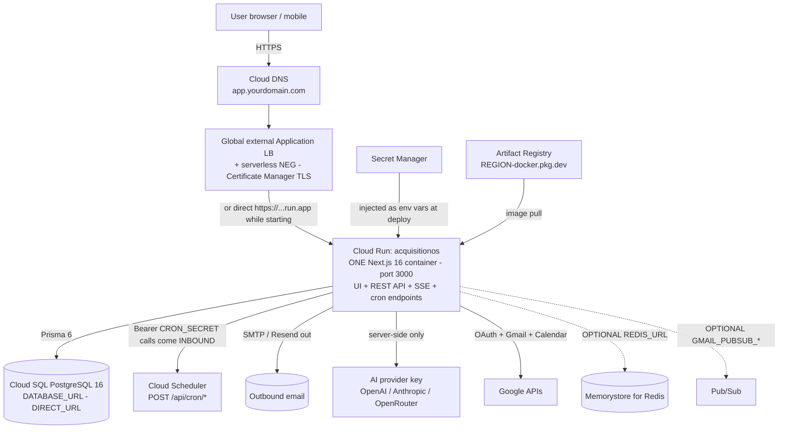

# GCP Architecture — How AcquisitionOS Maps onto Google Cloud

This page translates the verified AcquisitionOS architecture ([`../../01-architecture.md`](../01-architecture.md)) into concrete GCP services, states the facts you must design around, and lists what you should **not** provision. If this page and the code disagree, the code wins.

---

## 1. The mapping, service by service

| # | AcquisitionOS need | GCP service | Label | Why this service (and what to configure) |
| --- | --- | --- | --- | --- |
| 1 | Run one Next.js 16 standalone container (UI + `/api/**` + SSE + cron receivers), port 3000, Node 20 | **Cloud Run** | `REQUIRED FOR CURRENT ACQUISITIONOS` | Fully managed, scales instances 0→N. Configure: port 3000, `min-instances=1`, CPU always allocated, timeout 3600 s for SSE, memory ≥ 1 GiB, runtime service account. |
| 2 | PostgreSQL 14+ via Prisma (`prisma/schema.production.prisma`, 53+ models) | **Cloud SQL for PostgreSQL** (16) | `REQUIRED FOR CURRENT ACQUISITIONOS` | Managed engine, backups + PITR, Query Insights. Configure: `POSTGRES_16`, TLS required, database `acquisitionos`, app user `app_user`, backups + PITR on. |
| 3 | Secret storage for `JWT_SECRET`, `DATABASE_URL`, payment/AI/SMTP keys | **Secret Manager** | `REQUIRED FOR CURRENT ACQUISITIONOS` | Secrets injected as env vars via `--set-secrets`; access controlled with `roles/secretmanager.secretAccessor` on the runtime service account only. |
| 4 | Store and serve the container image | **Artifact Registry** (Docker) | `REQUIRED FOR CURRENT ACQUISITIONOS` | One repo per region: `REGION-docker.pkg.dev/YOUR_PROJECT_ID/acquisitionos`. Tag images with the Git SHA. |
| 5 | Call the 15 `/api/cron/*` + billing/feedback/gmail job endpoints on schedule, with `Authorization: Bearer <CRON_SECRET>` | **Cloud Scheduler** | `REQUIRED FOR CURRENT ACQUISITIONOS` | One HTTP job per endpoint; `POST` (payment-reconciliation is `GET`); the secret goes in the `Authorization` header — see §5. |
| 6 | DNS for `app.yourdomain.com` | **Cloud DNS** | `REQUIRED FOR CURRENT ACQUISITIONOS` (or keep your registrar's DNS) | Managed zone + `A`/`AAAA` (LB IPs) or `CNAME` (domain mapping). Same ecosystem makes Gmail Pub/Sub and OAuth wiring simpler. |
| 7 | TLS certificate | **Certificate Manager** (Google-managed) | `REQUIRED FOR CURRENT ACQUISITIONOS` | Auto-renewed; issued via LB IP route or DNS authorization — [`networking.md`](./networking.md). |
| 8 | Global edge / optional CDN / WAF | **Global external Application LB + serverless NEG**; Cloud Armor; Cloud CDN | `OPTIONAL` | Simple start uses the direct `run.app` URL (TLS included). Adopt the LB for custom domain + fixed IPs + WAF + SSE-appropriate timeouts. |
| 9 | Logs, metrics, alerts, traces | **Cloud Logging + Cloud Monitoring** | `OPTIONAL` (default-on logging; alerts recommended) | Cloud Run request logs + `/api/health` uptime checks; OTLP export supported via `OTEL_*` vars. |
| 10 | Gmail push notifications | **Pub/Sub** (topic + push subscription → `/api/gmail/pubsub/webhook`) | `OPTIONAL` (feature-level) | Native GCP fit; without it, schedule `/api/cron/process-gmail-replies` instead. |
| 11 | Multi-instance SSE fan-out | **Memorystore for Redis** (`REDIS_URL`) | `OPTIONAL` | With ≤ a few instances and `min-instances=1`, the in-process bus is enough. |
| 12 | Durable uploads (`public/feedback-uploads/`, `public/invoices/`) | **Cloud Storage** | `OPTIONAL` | Container filesystem is ephemeral; add object storage before users depend on uploads. |
| 13 | Build automation | **Cloud Build** | `OPTIONAL` | `docker build` works from any machine or GitHub Actions runner. |

---

## 2. Verify-your-own-facts table

Every architectural claim in this guide is checkable. Verify before you trust, and re-verify after app changes:

| Fact | How to verify it yourself |
| --- | --- |
| One container, port 3000 | `Dockerfile` (`EXPOSE 3000`, `CMD ["node","server.js"]`), `next.config.ts` (`output: 'standalone'`) |
| Production DB is PostgreSQL via Prisma | `prisma/schema.production.prisma` (`provider = "postgresql"`, `url`/`directUrl`), `../../04-database-production.md` |
| Auth is custom JWT, not NextAuth | `src/lib/auth.ts` (jose/jsonwebtoken + bcryptjs); `next-auth` is never imported (vestigial dependency) |
| Health endpoint for probes | `src/app/api/health/route.ts` — unauthenticated `GET /api/health` |
| Cron endpoints + auth header | `src/app/api/cron/*/route.ts` — each checks `Authorization: Bearer ${process.env.CRON_SECRET}` |
| Public URL resolution order | `src/lib/app-url.ts` (headers → `APP_PUBLIC_URL` → `NEXT_PUBLIC_APP_URL` → …) |
| SSE endpoints + heartbeats | `src/lib/sse-manager.ts`, `src/app/api/events/**` (15–30 s heartbeats) |
| Env var inventory | `src/lib/env-validation.ts`, `src/lib/env-safeguard.ts`, `../../02-environment-variables-and-secrets.md` |
| Cloud Run flag behavior (`--no-cpu-throttling`, timeout max 3600 s) | `gcloud run deploy --help` and https://cloud.google.com/run/docs — GCP docs are the source of truth for service limits |

---

## 3. What AcquisitionOS does NOT need (do not provision this)

Marking these clearly prevents the classic beginner mistake of building infrastructure the app will never use:

- **No GKE / Kubernetes.** `FUTURE/ALTERNATIVE`. The `deploy/k8s/*` files in the repo are legacy templates (Celery/Redis/Postgres stateful sets) that do **not** match the current Next.js app. One Cloud Run service replaces all of it.
- **No message queue.** `FUTURE/ALTERNATIVE`. No SQS-equivalent, no Pub/Sub *queues for jobs*, no Kafka. Jobs run in-process and via HTTP cron. (Pub/Sub appears only as the `OPTIONAL` Gmail push notification channel — a push transport, not a work queue.)
- **No in-app scheduler or worker processes.** There is no Celery beat, no node-cron inside the container. Cloud Scheduler is the **only** scheduler. If it is not scheduled, it does not run.
- **No NextAuth server** despite `next-auth` in `package.json` — never imported; auth is the custom JWT implementation.
- **No WebSocket server inside the app.** Production real-time is SSE. `socket.io-client` talks to an optional external WS service (`mini-services/*` is sandbox-local tooling — never deploy it).
- **No Redis by default.** `REDIS_URL`/Memorystore is `OPTIONAL`, needed only for multi-instance SSE fan-out.
- **No separate frontend tier** (no Vercel, no static bucket for pages) — the same container serves UI and API; `frontend.md` covers caching.
- **No VPN/Interconnect, no bastion hosts, no VMs** for the standard path — Cloud SQL Auth Proxy or private-IP + VPC access covers database connectivity.

---

## 4. SSE on Cloud Run — the settings that matter

`REQUIRED FOR CURRENT ACQUISITIONOS` if you want the notifications bell and other live streams to behave:

| Requirement | Value | Where it is set |
| --- | --- | --- |
| Minimum instances | **1** (never scale to zero) | `gcloud run deploy --min-instances=1` (a scaled-to-zero service breaks live streams and adds cold-start reconnects) |
| CPU allocation | **Always allocated** (no CPU throttling) | `gcloud run deploy --no-cpu-throttling` (console: "CPU is only assigned during request processing" → **off**). SSE requests spend most of their life idle between heartbeats; with throttled CPU they are starved. |
| Request timeout | **≥ 3600 s** for `/api/events` (Cloud Run maximum is 3600 s) | `gcloud run deploy --timeout=3600` — clients reconnect anyway; the long timeout avoids mid-stream resets |
| Load balancer timeout | **≥ 120 s** (default 30 s is too low) | Backend service `timeout` — [`networking.md`](./networking.md) |
| Response buffering | **Off** for `/api/events/*` | The LB path must not buffer; the app streams directly |
| Heartbeats | 15–30 s (app-provided) | Already in the app; keep LB idle timeout above it |
| Session affinity / WebSockets | **Not required** for SSE | Do not configure what you do not need; keep default connection draining |
| Multi-instance fan-out | `REDIS_URL` (Memorystore) or keep instance count small | `OPTIONAL` |

Why `min-instances=1` is not optional in practice: SSE connections are long-lived. If the service scales to zero between requests, every stream drops on every scale-down, and the first user after an idle period pays the cold start while their bell stays silent.

---

## 5. Scheduled work — the exact contract

The app exposes HTTP endpoints that Cloud Scheduler calls. Verified contract:

- Method: `POST` for all endpoints **except** `/api/cron/payment-reconciliation` (which is `GET`).
- Auth: header `Authorization: Bearer <CRON_SECRET>` — the endpoint compares the header value to the `CRON_SECRET` env var and returns 401 otherwise.
- `/api/gmail/jobs/process` additionally accepts `x-api-key: <GMAIL_CRON_API_KEY>`.

**GCP gotcha (documented, not invented):** Cloud Scheduler's built-in OIDC authentication writes its own Google-signed ID token into the `Authorization` header — the *same* header the app reads for `CRON_SECRET`. Using OIDC for these jobs therefore causes guaranteed 401s. Create the scheduler jobs with an explicit `--headers=Authorization=Bearer <CRON_SECRET>` (stored safely — see [`secrets.md`](./secrets.md)) and keep the endpoint reachable (public ingress or via the LB). This is the app's own design; the OIDC flags remain useful for authenticating *infrastructure* (e.g., CI deploys via Workload Identity Federation — [`terraform.md`](./terraform.md)).

The full endpoint list with suggested cadences: [`../../01-architecture.md`](../01-architecture.md) §2.4 and [`manual-deployment.md`](./manual-deployment.md) step 13.

---

## 6. Need-to-know runtime behaviors (recap)

| Behavior | Consequence on GCP |
| --- | --- |
| `NEXT_PUBLIC_*` vars are inlined at **build time** | Bake `NEXT_PUBLIC_APP_URL=https://app.yourdomain.com` into the image; rebuild when it changes. Runtime copies of the same vars still help server-side URL resolution. |
| Public URL falls back through headers → `APP_PUBLIC_URL` | The GCP LB forwards `Host` + `X-Forwarded-Proto` natively; still set `APP_PUBLIC_URL` explicitly. |
| Ephemeral filesystem | `public/` uploads vanish on redeploy/scale events → Cloud Storage (`OPTIONAL`) or accept the loss. |
| Every instance keeps its own Prisma pool | Budget: `instances × connection_limit < max_connections` — [`database.md`](./database.md). |
| `AUTH_DEV_MODE` hard-gates off in production | Nothing to configure — just never set it. |
| z-ai primary AI provider reads no keys | Outside the GLM sandbox its availability is `NEEDS VERIFICATION` — set at least one fallback key (`OPENAI_API_KEY` / `ANTHROPIC_API_KEY` / `OPENROUTER_API_KEY`). |

---

## 7. Official documentation

- Cloud Run (architecture, CPU allocation, timeouts) — https://cloud.google.com/run/docs
- Serverless NEGs / Cloud Run behind an LB — https://cloud.google.com/load-balancing/docs/https/setup-global-ext-https-serverless
- Cloud SQL for PostgreSQL — https://cloud.google.com/sql/docs/postgres
- Secret Manager — https://cloud.google.com/secret-manager/docs
- Cloud Scheduler (HTTP targets, OIDC behavior) — https://cloud.google.com/scheduler/docs
- Artifact Registry — https://cloud.google.com/artifact-registry/docs
- Pub/Sub — https://cloud.google.com/pubsub/docs
- Memorystore for Redis — https://cloud.google.com/memorystore/docs/redis
- Terraform Google provider — https://registry.terraform.io/providers/hashicorp/google/latest/docs
