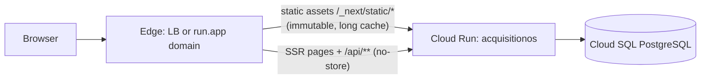

# GCP Frontend — Serving the Next.js UI on Cloud Run

AcquisitionOS has **no separate frontend service**. The Cloud Run container you deployed in [`manual-deployment.md`](./manual-deployment.md) serves the React UI, the static assets, **and** the `/api/**` backend from one process on port 3000. This page covers only the frontend-specific questions: build-time variables, caching/CDN, custom domains, and staging/preview environments.

---

## 1. One container, two roles



- **Pages** are server-rendered (App Router) or client-hydrated — always by the same Node server.
- **Static assets** (`/_next/static/...`, files in `public/`) are served by the Next.js server with long-lived cache headers (see §3).
- You never deploy "the frontend" alone; a deploy is always the whole image.

---

## 2. Build-time vs runtime variables (the one thing people get wrong)

| Kind | Examples | When it takes effect | Changing it requires |
| --- | --- | --- | --- |
| **Build-time** (`NEXT_PUBLIC_*`) | `NEXT_PUBLIC_APP_URL`, `NEXT_PUBLIC_APP_VERSION` | Inlined into client JavaScript when `next build` runs inside the Docker build | **Rebuilding + redeploying the image** |
| **Runtime** (everything else) | `APP_PUBLIC_URL`, `DATABASE_URL`, `JWT_SECRET`, `SMTP_*`, … | Read by the Node process at request time | New Secret Manager version / `--set-env-vars` + service update |

Practical rules for AcquisitionOS:

1. Decide your final `https://app.yourdomain.com` **before** the production image build, and make sure the build environment has `NEXT_PUBLIC_APP_URL` set — otherwise client code falls back to whatever was inlined at build time (the app's URL resolution order and fallbacks are documented in [`../../01-architecture.md`](../01-architecture.md) §2.2).
2. Also set `APP_PUBLIC_URL` (runtime) to the same value — the server uses it for magic links, OAuth redirects, and webhook-visible URLs.
3. Changing the domain later = rebuild the image (so the inlined value updates) **and** update the runtime env vars, then redeploy.
4. Verify what was inlined: open the site, view source, and search for your domain inside the bundled `/_next/static/` chunks.

---

## 3. Caching and Cloud CDN

**What the app already does:** the production build ships sensible cache headers — long-lived, immutable responses for versioned static assets under `/_next/static/`, and no-store semantics for API responses so `/api/**` is never cached by anyone in the chain. Because the app sets correct headers itself, GCP-side caching is a pure optimization, not a correctness fix.

**Your options on GCP:**

| Option | What | Label |
| --- | --- | --- |
| No CDN — requests hit Cloud Run directly | Simplest; Cloud Run + Next.js handles the traffic fine at small/medium scale | `REQUIRED`-baseline (nothing to configure) |
| **Cloud CDN on the load balancer** | Cache static assets at Google's edge; **bypass cache for `/api/*`** (the LB route must never cache the API or SSE streams) | `OPTIONAL` |
| Memorystore / Redis | Not a page cache — only the `OPTIONAL` SSE fan-out (`REDIS_URL`) | `OPTIONAL` |

If you enable Cloud CDN (only on the Path B load balancer from [`networking.md`](./networking.md)):

```bash
gcloud compute backend-services update acquisitionos-bes --global --enable-cdn --cache-mode=CACHE_ALL_STATIC
# Then add a bypass/rewrite rule so /api/** (especially /api/events/*) is never cached:
#   console: Network services → Cloud CDN → origin rule for "/api/*" → BYPASS CACHE
```

SSE reminder: `/api/events/*` responses must never be buffered or cached anywhere — see [`networking.md`](./networking.md) §5.

---

## 4. Custom domain + HTTPS

Two paths, same destination (`REQUIRED FOR CURRENT ACQUISITIONOS` for production — cookies are `secure` and OAuth requires HTTPS):

| Path | How | Recommendation |
| --- | --- | --- |
| **Global external Application LB + serverless NEG + Certificate Manager** | Fixed anycast IPs, full control of routes/headers/timeouts, CDN/WAF options | The flexible, current best-practice path — full walkthrough in [`networking.md`](./networking.md) §3–4 |
| **Cloud Run domain mapping** (`gcloud beta run domain-mappings create`) | One command + the DNS records it prints; Google-managed cert auto-issued | Simpler, but legacy-ish and less flexible (no WAF, no route-level control, limited apex support) |

Both end the same way: `https://app.yourdomain.com` serves the app, and you finish the checklist in [`manual-deployment.md`](./manual-deployment.md) step 14 (DNS verify, `APP_PUBLIC_URL` rebuild, OAuth redirect URIs, webhook registrations). DNS record mechanics (apex vs `www`, TTL, propagation) live in [`../../06-dns-and-domains.md`](../06-dns-and-domains.md).

---

## 5. CORS — you do not need it

The UI calls `/api/**` on the **same origin** (`app.yourdomain.com` → `app.yourdomain.com/api/...`). Same-origin requests carry no CORS preflight burden, auth cookies are first-party, and no `Access-Control-Allow-Origin` juggling is required. The app contains CORS tooling (`src/lib/security/cors-config.ts`) for the rare split-host setup — if you ever split an `api.` subdomain, read [`../../06-dns-and-domains.md`](../06-dns-and-domains.md) §3 first and keep `APP_PUBLIC_URL`/`NEXT_PUBLIC_APP_URL` consistent.

---

## 6. Preview and staging environments

Cloud Run has no built-in Vercel-style "preview URL per pull request" — the pattern that matches the platform:

- **One Cloud Run service per environment**: `acquisitionos-staging`, `acquisitionos-dev` (same image, different revisions). Each gets:
  - its **own database** (staging Cloud SQL instance or a separate database + user — never shared with production),
  - its **own Secret Manager secrets** (label them `env=staging`),
  - its own domain (`staging.yourdomain.com` via the same LB or a domain mapping).
- **Image-per-commit** promotion: build once per Git SHA, deploy the same `:GITSHA` image to staging, then production after approval — the branch strategy and GitHub Environment gating are in [`../../05-cicd.md`](../05-cicd.md).
- Per-commit ephemeral preview services are possible to script (create service → run tests → delete) but are extra machinery — `FUTURE/ALTERNATIVE`, not part of the baseline deployment.

```bash
# Staging service from the same image:
gcloud run deploy acquisitionos-staging \
  --image="$IMAGE_URL" \
  --region="$REGION" \
  --service-account="$RUNTIME_SA_STAGING" \
  --port=3000 --min-instances=0 --max-instances=2 --cpu=1 --memory=1Gi \
  --set-secrets=...staging-secrets... \
  --set-env-vars=APP_PUBLIC_URL=https://staging.yourdomain.com,NEXT_PUBLIC_APP_URL=https://staging.yourdomain.com
# Note min-instances=0 is acceptable for staging: no one is watching SSE there at 3am.
```

Remember: staging needs its own Cloud Scheduler jobs (pointing at the staging host with the staging `CRON_SECRET`) if you want scheduled behavior there.

---

## 7. Related pages

| Topic | Where |
| --- | --- |
| CI/CD pipeline (build → staging → production) | [`../../05-cicd.md`](../05-cicd.md) + `cicd.md` in this folder |
| Rollback (redeploy the previous image tag / shift traffic back to the prior revision) | `rollback.md` in this folder; quick form: `gcloud run services update-traffic acquisitionos --to-revision=acquisitionos-000XX --region="$REGION"` |
| Troubleshooting (502s, cold starts, health check failures) | `troubleshooting.md` in this folder |
| Timeouts, headers, SSE transport details | [`networking.md`](./networking.md) |
| Full env-var inventory | [`../../02-environment-variables-and-secrets.md`](../02-environment-variables-and-secrets.md) |

---

## 8. Official documentation

- Cloud Run overview + deploying — https://cloud.google.com/run/docs
- Cloud Run and Cloud CDN — https://cloud.google.com/cdn/docs/using-serverless-negs (serverless origins)
- Next.js deployment (self-hosting, standalone) — https://nextjs.org/docs/app/getting-started/deploying
- Next.js environment variables — https://nextjs.org/docs/app/building-your-application/configuring/environment-variables
- Next.js static asset caching — https://nextjs.org/docs/app/building-your-application/caching
- Cloud Run custom domains — https://cloud.google.com/run/docs/mapping-custom-domains
- Cloud Run revisions & traffic splitting — https://cloud.google.com/run/docs/rollbacks-troubleshooting
