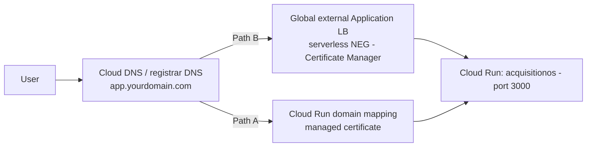

# GCP Networking — Load Balancer, TLS, VPC Access, and SSE Requirements

Two honest paths exist for exposing AcquisitionOS on GCP. Start simple; graduate to the load balancer when you need fixed IPs, a WAF, or multiple services on one domain.

| Path | What you get | Label |
| --- | --- | --- |
| **A. Direct `run.app` URL / Cloud Run domain mapping** | HTTPS URL on `*.run.app` or your domain via a managed cert; zero networking to build | `REQUIRED FOR CURRENT ACQUISITIONOS` (minimum: one of the two) |
| **B. Global external Application Load Balancer + serverless NEG + Certificate Manager** | Your domain on fixed anycast IPs, WAF option, LB-level timeout control, room for more services | `OPTIONAL` (recommended for production) |

Everything on this page keeps one rule from [`../../01-architecture.md`](../01-architecture.md) §2.2 intact: **the app derives its public URL from proxy headers (`Host`, `X-Forwarded-Proto`) plus `APP_PUBLIC_URL`** — both paths satisfy this; never strip those headers.

---

## 1. The two paths



Path A steps live in [`manual-deployment.md`](./manual-deployment.md) step 14 (`gcloud beta run domain-mappings create ...` + the DNS records it prints). Note: domain mapping is the older, simpler integration — Google's current recommended pattern is Path B, which is why this page exists.

---

## 2. Reaching Cloud SQL private IP (VPC access) — `OPTIONAL`

`REQUIRED` only if you choose **private-IP Cloud SQL** ([`database.md`](./database.md) §4). Two Google-supported mechanisms; either works:

| Mechanism | How it works | When to pick it |
| --- | --- | --- |
| **Direct VPC egress** (newer) | Cloud Run instances get addresses from a VPC subnet; egress flows through your VPC | Simplest private connectivity; no connector to run |
| **Serverless VPC Access connector** | A small managed proxy instance connects Cloud Run to the VPC | Older pattern; needed for shared-VPC edge cases |

```bash
# Direct VPC egress — deploy with:
gcloud run deploy acquisitionos \
  --network=YOUR_VPC_NETWORK --subnet=YOUR_SUBNET --vpc-egress=all-traffic \
  # ... all other flags from manual-deployment.md step 11

# Serverless VPC Access connector — alternative:
gcloud compute networks vpc-access connectors create aos-connector \
  --region=us-central1 --range=10.8.0.0/28
gcloud run deploy acquisitionos --vpc-connector=aos-connector --vpc-egress=all-traffic
```

Then `DATABASE_URL` points at the instance's **private IP** (`gcloud sql instances describe ... --format='value(ipAddresses[0].ipAddress)'`). Egress rules must allow TCP 5432 to the Cloud SQL range.

If you stay on the default path (public IP + TLS + `--add-cloudsql-instances` unix socket — [`manual-deployment.md`](./manual-deployment.md) step 11), you need **none** of this section.

---

## 3. Path B walkthrough: load balancer + serverless NEG

**What:** a serverless NEG (network endpoint group) points a global external Application Load Balancer at a Cloud Run service — no instance groups, no health checks to configure (Cloud Run readiness is used internally).

**Why (for AcquisitionOS):** custom domain with managed cert on fixed IPs; LB timeout raised above the SSE heartbeat requirement; later, Cloud Armor and extra routes (e.g. `api.`) without touching the app.

```bash
export REGION="us-central1"                # same value as manual-deployment.md step 0
export SERVICE_NAME="acquisitionos"
export APP_DOMAIN="app.yourdomain.com"

# 3a. Serverless NEG targeting the Cloud Run service
gcloud compute network-endpoint-groups create acquisitionos-neg \
  --region="$REGION" \
  --network-endpoint-type=serverless \
  --cloud-run-service="$SERVICE_NAME"
# Expected: Created [.../networkEndpointGroups/acquisitionos-neg].

# 3b. Global backend service (EXTERNAL_MANAGED = the current global external ALB)
gcloud compute backend-services create acquisitionos-bes \
  --global --load-balancing-scheme=EXTERNAL_MANAGED --protocol=HTTPS
gcloud compute backend-services add-backend acquisitionos-bes \
  --global \
  --network-endpoint-group=acquisitionos-neg \
  --network-endpoint-group-region="$REGION"

# 3c. THE SSE-CRITICAL SETTING: raise the backend timeout (default 30 s is too low — see §5)
gcloud compute backend-services update acquisitionos-bes \
  --global --timeout=3600

# 3d. Reserve a global anycast IP
gcloud compute addresses create acquisitionos-ip --global
gcloud compute addresses describe acquisitionos-ip --global --format='value(address)'

# 3e. URL map (one default route for now)
gcloud compute url-maps create acquisitionos-urlmap \
  --default-service=acquisitionos-bes

# 3f. HTTPS proxy + certificate (§4) + forwarding rule on 443
gcloud compute target-https-proxies create acquisitionos-https-proxy \
  --url-map=acquisitionos-urlmap \
  --certificate-map=acquisitionos-certmap
gcloud compute forwarding-rules create acquisitionos-https-fr \
  --global --address=acquisitionos-ip --ports=443 \
  --target-https-proxy=acquisitionos-https-proxy \
  --load-balancing-scheme=EXTERNAL_MANAGED

# 3g. DNS: A record  app.yourdomain.com -> the reserved IP (Cloud DNS or registrar)
gcloud dns record-sets create "app.yourdomain.com." \
  --zone=acquisitionos --type=A --ttl=300 \
  --rrdatas=YOUR_RESERVED_LB_IP
```

Expected output per command: `Created ...`. Verify end-to-end:

```bash
curl -I https://app.yourdomain.com           # 200/307 + Google Trust Services certificate
curl -s https://app.yourdomain.com/api/health | head -c 300
```

Finally, restrict direct access to the `run.app` URL so traffic enters only via the LB:

```bash
gcloud run deploy "$SERVICE_NAME" --region="$REGION" --ingress=internal-and-cloud-load-balancing
# ...all other flags identical to manual-deployment.md step 11
```

---

## 4. TLS: Certificate Manager (Google-managed)

**What:** Google issues and auto-renews the certificate. **Why:** auth cookies are `secure` in production; a broken cert = broken login.

Two issuance routes:

- **Route via the LB (used in §3f):** create a certificate + certificate map and attach the map to the HTTPS target proxy. Google completes the challenge once DNS points the domain at the LB IP.
  ```bash
  gcloud certificate-manager certificates create acquisitionos-cert --domains="$APP_DOMAIN"
  gcloud certificate-manager maps create acquisitionos-certmap
  gcloud certificate-manager maps entries create app-entry \
    --map=acquisitionos-certmap --certificates=acquisitionos-cert --hostname="$APP_DOMAIN"
  ```
- **DNS authorization (domain not yet on the LB):** create a DNS authorization, add the TXT/CNAME record it prints, then attach it to the certificate. Useful when you must prove domain control before routing.
  ```bash
  gcloud certificate-manager dns-authorizations create acquisitionos-auth --domain="$APP_DOMAIN"
  gcloud certificate-manager dns-authorizations describe acquisitionos-auth   # shows the record to add
  ```

Verify: `gcloud certificate-manager certificates describe acquisitionos-cert` → state `ACTIVE`. Allow minutes to a few hours after DNS propagates.

---

## 5. SSE on the load balancer — the settings that matter

`REQUIRED FOR CURRENT ACQUISITIONOS` whenever Path B is in front of `/api/events/*`:

| Requirement | Value | Command / location |
| --- | --- | --- |
| LB backend timeout | **≥ 120 s** — the default **30 s MUST be raised**; 3600 s matches the app | `gcloud compute backend-services update ... --timeout=3600` (§3c) |
| Response buffering | **Off** for `/api/events/*` | Serverless NEG backends stream through; do **not** enable Cloud CDN on the `/api/events/*` route; no gzip/buffer layer in front |
| Session affinity | **Not required** for SSE | Leave unset — heartbeats + client reconnect handle re-routing |
| WebSockets | Not used by the app for real-time (SSE is) | No config needed |
| Connection draining | Keep the default (~300 s) | Gives in-flight SSE streams time to finish during backend swaps |
| Cloud CDN | Off for `/api/**` (the app sets correct cache headers itself — see [`frontend.md`](./frontend.md)) | If CDN is enabled, add a cache-bypass rule for `/api/*` |

The heartbeat math: the app streams every 15–30 s; an idle timeout below that kills healthy streams mid-connection. 120 s is the handbook-wide floor ([`../../01-architecture.md`](../01-architecture.md) §2.3); on GCP there is no reason not to use 3600 s to match Cloud Run.

---

## 6. Header forwarding — critical for `src/lib/app-url.ts`

The app resolves its public URL from `x-forwarded-host`/`x-forwarded-proto`/`host` headers first, then `APP_PUBLIC_URL` ([`../../01-architecture.md`](../01-architecture.md) §2.2). Consequences on GCP:

- **Path A and Path B both preserve `Host` and add `X-Forwarded-Proto: https` by default** — no special config needed; just do not add header-rewriting that drops them.
- Still set `APP_PUBLIC_URL=https://app.yourdomain.com` explicitly so URL derivation never depends on proxy behavior.
- If you ever introduce a third proxy (e.g. Cloudflare in front of the LB), re-verify the headers survive — [`../../06-dns-and-domains.md`](../06-dns-and-domains.md) §3.

Verify:

```bash
# From anywhere: the app should generate correct absolute links (e.g. in a magic-link email).
curl -sI https://app.yourdomain.com | grep -i -E "location|content-type"
```

---

## 7. Cloud Armor — basic WAF — `OPTIONAL`

Only available on the LB path; protects the whole app (including webhook and OTP endpoints) from obvious abuse:

```bash
# What: a minimal rate-limiting policy; preconfigured WAF rules (SQLi/XSS) are a next step.
gcloud compute security-policies create aos-armor --description="AcquisitionOS edge protection"
gcloud compute security-policies rules create 1000 \
  --security-policy=aos-armor \
  --expression="true" \
  --action=throttle --rate-limit-threshold-count=600 --rate-limit-threshold-interval-sec=60 \
  --conform-action=allow --exceed-action=deny-429 --enforce-on-key=IP
gcloud compute backend-services update acquisitionos-bes --global --security-policy=aos-armor
```

Keep rules allow-list friendly for webhooks (Stripe/Razorpay POSTs come from provider IPs; a too-aggressive rule breaks billing webhooks). Start with monitoring/threshold rules only.

---

## 8. Verification checklist

```text
[ ] curl -I https://app.yourdomain.com        → 200/307, valid Google-managed certificate
[ ] curl -s https://app.yourdomain.com/api/health → 200
[ ] run.app URL returns 403/404 after --ingress=internal-and-cloud-load-balancing (LB-only)
[ ] Notifications bell SSE stream survives > 5 minutes of idle (LB timeout raised)
[ ] Magic-link email contains https://app.yourdomain.com links (headers intact)
[ ] dig app.yourdomain.com +short             → reserved LB IP (Path B) or mapping IPs (Path A)
```

---

## 9. Official documentation

- External Application Load Balancer with serverless NEGs — https://cloud.google.com/load-balancing/docs/https/setup-global-ext-https-serverless
- Backend service timeouts — https://cloud.google.com/load-balancing/docs/backend-service (timeout semantics; 30 s default)
- Certificate Manager — https://cloud.google.com/certificate-manager/docs
- Certificate Manager DNS authorizations — https://cloud.google.com/certificate-manager/docs/dns-authorizations
- Direct VPC egress — https://cloud.google.com/run/docs/configuring/direct-vpc
- Serverless VPC Access — https://cloud.google.com/vpc/docs/serverless-vpc-access
- Cloud Armor — https://cloud.google.com/armor/docs
- Ingress settings for Cloud Run — https://cloud.google.com/run/docs/securing/ingress
